## 更新还是删除缓存？
当数据变更时，可以选择更新缓存，也可以选择删除缓存，各有优劣，我们下面尝试分析他们的优缺点，并提出新的做法：

#### 删除缓存
如果我们采取删除缓存策略，查询时再按需生成缓存，那么在高并发的情况下，如果删除了一个热点数据，那么此时会有大量请求会无法命中缓存。这是一个头疼的问题

为了防止缓存击穿，通用的做法是使用分布式 Redis 锁保证只有一个请求到数据库，等缓存生成之后，其他请求进行共享。这种方案能够适合很多的场景，但有些场景却不适合。例如有一个重要的热点数据，计算代价比较高，需要3s才能够获得结果，那么上述方案在删除一个这种热点数据之后，就会在这个时刻，有大量请求3s才返回结果，一方面可能造成大量请求超时，另一方面3s没有释放链接，会导致并发连接数量突然升高，可能造成系统不稳定。

另外使用 Redis 锁时，未获得锁的这部分用户，通常会定时轮询锁，而这个睡眠时间不好设定。如果设定比较大的睡眠时间1s，那么对于200ms就计算出结果的缓存数据，返回太慢了；如果设定的睡眠时间太短，那么很消耗 CPU 和 Redis 性能

#### 更新缓存
如果我们采取更新缓存策略，那么存在的问题是：每一个数据修改，都会重新生成缓存，没有区分冷热数据，冷数据会浪费相关的存储资源和计算资源。

#### 延迟删除
那么有没有两全其美的办法呢？既不浪费存储和计算资源，还能够解决缓存击穿问题？有的！延迟删除法，延迟删除法的工作原理如下：
1. 当数据变更时，在 Redis 中查找数据，如果数据不存在，什么都不做；如果数据存在，那么将该数据标记为删除，并且将该数据的过期时间设置为10s。
2. 当从缓存读取数据时，如果发现数据被标记为删除，或者锁定已经过期，那么将数据标记为被锁定到now+4s，然后去数据库中读取数据，然后写入缓存，清除标记。
3. 当从缓存读取数据时，如果发现数据被标记为已锁定，那么返回旧的数据，如果没有旧数据，则sleep 1s后再次尝试

这种延迟删除法，具备以下优点：
1. 冷数据不会占用大量存储和计算资源，只有真实被请求的数据，才会生成缓存，占用存储空间
2. 不会出现上述缓存击穿的情况。当更新了热点数据缓存时，在这3s计算缓存数据时，会返回旧数据，避免了请求超时等情况

我们来看看各种情况下，延迟删除法是否会出现问题：
1. 热点数据，每秒1K qps，计算缓存时间5ms，此时延迟删除法，大约5ms左右的时间里，会返回过期数据，而先更新DB，再更新缓存，也会有大约1~10ms返回过期数据，因此两者差别不大。
2. 热点数据，每秒1K qps，计算缓存时间3s，此时延迟删除法，大约3s的时间里，会返回过期数据。对比于等待3s后再返回数据，那么返回旧数据，通常是更好的行为。
3. 普通数据，每秒50 qps，计算缓存时间1s，此时延迟删除法的行为分析，类似2，没有问题。
4. 低频数据，5秒访问一次，计算缓存时间3s，此时延迟删除法的行为与删除缓存策略基本一样，没有问题
5. 冷数据，10分钟访问一次，此时延迟删除法，与删除缓存策略基本一样，只是数据比删除缓存的方式晚删除10s，没有问题

有一种极端情况是，那就是原先缓存中没有数据，突然大量请求到来，这种场景对删除缓存法，延迟删除法，更新缓存法，都是不友好的。这种的场景是开发人员需要避免的，需要通过预热来解决，而不应当直接扔给缓存系统。

延迟删除能够很好的处理缓存中的各类情况，原理稍微复杂一写，需要通过lua脚本来实现，但好处是，可以实现为一个sdk，充分复用，无需每个开发人员都做。感兴趣的同学，可以自己动手实现。

## 乱序产生的不一致
前面所说的不一致，主要是不能同时更新数据库和更新缓存导致的，不一致的窗口为更新两者之间的时间差。然后还有一种数据不一致，发生的概率较低，下面我们来看看这种情况的时序图：

在上述这个时序图中，由于服务1发生了进程暂停（例如由于GC导致），因此当它往缓存当中写入v1时，覆盖了缓存中的v2，导致了最终的不一致（DB中为v2，缓存中为v1）。

对于上述这类问题应当如何解决？其实这种问题是版本相关的问题，推荐的解决办法是采用类似于乐观锁的版本控制。具体到这个问题，可以
- 更新数据库时，采用乐观锁，先获取数据库中的旧版本 v1，更新数据库时，update set v=v1+1 where v=v1
- 更新缓存时，也要带上版本号，可以通过类似这个语义的lua脚本来更新，update set v=v2 where v < v2，以这种方式保证不会出现旧的版本覆盖新的版本

这里的版本机制，依赖于缓存中记录了旧版本。如果进程暂停的时间，比延迟删除的时间长，那么就有极低的概率会发生数据库中是v2，而缓存中是v1。如果您的应用对这种极低概率的不一致也不能容忍，那么可以将延迟删除策略中的延迟时间设置为1天或者更长，那么这个问题就解决了。
## 能否做到强一致？
上面已经介绍了缓存一致性的各种场景，以及相关的解决方案，那么是否可以保证使用缓存的同时，还提供强一致的数据读写呢？

当我们在这里讨论强一致时，我们需要先把一致性的含义做一下明确。

开发者最直观的强一致性很可能理解为，数据库和缓存保持完全一致，写数据的过程中以及写完之后，无论从数据库直接读，或者从缓存直接读，都能够获得最新写入的结果。对于这种的“强一致性”，可以非常明确的说，理论上是不可能的，因为更新数据库和更新缓存在不同的机器上，无法做到同时更新，无论如何都会有时间间隔，在这个时间间隔里，一定是不一致的。

但是应用层的强一致性，则是可以做到的。可以简单考虑我们熟悉的场景：CPU的缓存作为内存的缓，内存作为磁盘的缓存，这些都是缓存的场景，从来没有发生过一致性问题。为什么？其实很简单，要求所有的数据使用方，只能够从缓存读取数据，而不能同时从缓存和底层存储同时读取数据。

对于DB和Redis，只要我们要求所有的数据读取，都经过缓存，那么就是强一致，不会出现不一致的情况。下面我们来根据DB和Redis的特点，来分析其中的设计：

#### 先更新缓存还是DB
类比CPU缓存与内存，内存缓存与磁盘，这两个系统都是先修改缓存，再修改底层存储，那么到了现在的DB缓存场景是否也修改缓存再修改DB？

在绝大多数的应用场景下，开发者会认为Redis作为缓存，当Redis出现故障时，那么应用需要支持降级处理，依旧能够访问数据库，提供一定的服务能力。考虑这种场景，一旦出现降级，先写缓存再写DB方案就有问题，就会发生先读取到新版本v2，在读取到旧版本v1。因此在Redis作为缓存的场景下，大部分系统会采取先写入DB，在写入缓存的这种设计

#### 写入DB成功缓存失败情况
假如因为进程crash，导致写入DB成功，但是标记延迟删除第一次失败怎么办？虽然间隔几秒之后，会重试成功，但这几秒钟的时间里，用户去读取缓存，依旧还是旧版本的数据。例如用户发起了一笔充值，资金已经进入到DB，只是更新缓存失败，导致从缓存看到的余额还是旧值。这种情况的处理很简单，用户充值时，写入DB成功时，应用不要给用户返回成功，而是等缓存更新也成功了，再给用户返回成功；用户查询充值交易时，要查询DB和缓存是否都成功了，只有两者都成功了，才返回成功。

在上述的处理策略下，当用户发起充值后，在缓存更新完成之前，用户看到的是，这笔交易还在处理中，结果未知，那么依旧是符合强一致的要求。

#### 降级升级的处理
现在我们来考虑应用在Redis缓存出现问题的升降级处理。一般情况下这个升降级的开关在配置中心，当修改配置后，各个应用进程会陆续收到降级配置变更通知，然后在行为上降级。在降级的过程中，会出现缓存与DB混合访问的情况，这时我们上面的方案就有可能出现不一致。那么如何处理才能够保证在这种混合访问的情况下，依旧能够让应用获取到强一致的结果呢？

混合访问的过程中，我们可以采取下面这个策略，来保证DB和缓存混合访问时的数据一致性。
- 更新数据时，使用分布式事务，保证以下操作为原子操作
  - 将缓存标记为“更新中”
  - 更新DB
  - 将缓存“更新中”标记去除，标记为延迟删除
- 读取缓存数据时，对于标记为“更新中”的数据，睡眠等待后再次读取；对于延迟删除的数据，不返回旧数据，等待新数据完成再返回。
- 读取DB数据时，直接读取，无需任何额外操作

当降级完成，是只访问DB，不访问缓存的。因此降级的详细过程需要如下：
1. 最初状态：全部读缓存，写DB+缓存
2. 打开读降级：部分读缓存，部分读DB，写DB+缓存
3. 读降级完成：全部读DB，写DB+缓存
4. 打开写降级：全部读DB，部分只写DB，部分写DB+缓存
5. 写降级完成：全部读DB，全部只写DB

按照上述的几个步骤进行，能够保证整个降级的过程中，应用访问数据是强一致的。升级的过程与此相反，如下：
1. 最初状态：全部读DB，全部只写DB
2. 打开写升级：全部读DB，部分只写DB，部分写DB+缓存
3. 写升级完成：全部读DB，全部写DB+缓存
4. 打开读升级：部分读缓存，部分读DB，全部写DB+缓存
5. 读升级完成：全部读缓存，全部写DB+缓存

## 小结
这篇文章很长，许多的分析比较晦涩，最后将缓存的使用方式做个总结：
- 最简单的方式为：较短的缓存时间，允许少量数据库修改，未同步删除缓存
- 一致性较好的方式为：二阶段消息+删除缓存
- 保证最终一致，并且可防缓存击穿的方式为：二阶段消息+延迟删除
- 一致性要求最严苛的方式为：延迟删除+升降级兼容
