# 秒杀
本文介绍一种秒杀的新架构，能够支持每秒超万单精准扣库存，并且保证创建订单和扣减库存的数据最终完全一致。

## 现有秒杀系统的问题
现有的秒杀架构，为了支持高并发，通常把库存放在Redis中，收到订单请求时，在Redis中进行库存扣减。这种的设计，导致创建订单和库存扣减不是原子操作，如果两个操作中间，遇到进程crash等问题，就会导致数据不一致。

即使库存扣减不放在Redis中，而是放在数据库，不一致问题也通常是存在的。业务系统为了模块化，减少耦合，也是很可能将将库存服务与订单服务分开。只要是分开的服务，那么数据不一致的情况就是无法避免的。

进程crash等问题，虽然发生的概率不高，但即使占比百分之一，甚至千分之一，都会产生数据不一致，例如扣减的库存量和创建成功的订单不一致。这些不一致情况非常头疼，开发人员需要进行大量的开发工作，自动检测数据不一致的情况，然后进行自动的数据修复或者手动的数据修复。

## 整体架构
我们先把业务背景分析清楚，秒杀系统最最难的点，是创建订单和扣减库存两者会有数据不一致性，那么我们假定要解决的业务场景为：
- 用户进行秒杀，会在某个时间点发送大量的请求到后端，请求量会大大高于库存数量
- 后端需要保证库存扣减和订单创建是最终严格一致的，即使中间发生进程crash，最终数据不会受到影响

新架构使用了分布式事务框架dtm，对于绝大部分扣减库存失败的用户请求，时序图如下：



在这个时序图中，扣减库存是在Redis中进行的，与dtm相关的注册全局事务和取消全局事务也是在Redis中处理的，因此能够支持高并发，在dtm的测试数据中，可以轻易处理每秒上万单的失败请求。

虽然大部分请求因为扣减库存失败而结束，但是会有一定数量的请求，扣减库存成功，这种情况的时序图如下：



在这个时序图中，扣减库存成功后，会进入到订单服务，进行订单相关的创建，以及后续的支付。在这个新架构中，订单系统仅需要处理有效订单，因此并发量已经大幅下降，只需要通过常规的方法，例如订单分库分表、消息队列削峰处理，就可以了。

## 原子操作
在上述的架构中，如果在Redis中扣减库存后，在提交全局事务前，发生进程crash，就会产生两个操作没有同时完成，那么这种情况后续会怎么样？这种情况的整个的时序图如下：



一旦发生这类进程crash，导致两个操作过程中断，那么dtm服务器会发现已Prepare，但是还没有Submit的全局任务，那么他会调用反查接口，询问应用，库存扣减是否成功扣减。如果已扣减，则认为全局事务已提交，如果未扣减，那么认为全局事务需要被取消。

详细原理，以及各种情况，可以参考[二阶段消息](../practice/msg)，这里不做详细的描述。

## 核心代码

秒杀接口的核心代码如下：
``` Go
gid := "flash-sale-" + activityID + "-" + uid
msg := dtmcli.NewMsg(DtmServer, gid).
	Add(busi.Busi+"/createOrder", gin.H{activity_id: activityID, UID: uid})
err := msg.PrepareAndSubmitBarrier(busi.Busi+"/QueryPreparedRedis", func(bb *BranchBarrier) error {
  return bb.RedisCheckAdjustAmount(rds, "stock-"+stockID, -1, 86400)
})
```

- 行1: 秒杀活动，一般情况下，一个用户仅能购买一次，因此按照活动id+用户id作为全局事务ID，能够保证用户最多生成一个全局事务，最多创建一个订单
- 行2: 创建一个二阶段消息的对象，填入dtm服务器地址，以及全局事务id
- 行3: 给二阶段消息添加一个分支事务，该事务分支为创建订单服务
- 行4: 调用二阶段消息的PrepareAndSubmitBarrier，该函数第一个参数为反查的URL（见上图中的反查），第二个参数为一个回调函数，里面会包含业务逻辑
- 行5: 调用RedisCheckAdjustAmount，该函数会进行库存扣减，这个函数进行库存扣减时，如果库存不够，则会返回错误；如果库存足够，则会扣减库存，并记录库存已扣减成功，这样可以保证这个操作幂等，并且保证后续的反查能够获得正确的结果

反查的核心代码如下：
``` Go
	app.GET(BusiAPI+"/QueryPreparedRedis", dtmutil.WrapHandler2(func(c *gin.Context) interface{} {
		return MustBarrierFromGin(c).QueryPreparedRedis(rds)
	}))
```
反查的逻辑很简单，对于Redis里面的数据，只需要复制粘贴这上面的代码就行

## 性能
从上面的介绍中，可以看到，对于大部分扣减库存失败的请求，需要进行三个Redis操作，一个扣减库存，两个全局事务操作，这个三个操作都是lua脚本实现。一个普通的redis，每秒大约能够支持6w个lua脚本操作，照此分析，我们的新架构，大约每秒能够支持2w个请求。下面是我做的性能测试报告：

`待更新`

更进一步，扣减库存与全局事务可以使用不同的Redis，那么单独一个Redis来支持库存扣减的话，是可以达到6w/s，如果更进一步，采用Redis6的多线程IO，可以获得更高的性能，大约达到15w/s。而这里面的dtm只需要部署多组，或者未来使用集群版，就可以提供远超15w/s的支持。

上述的分析仅限于普通云厂商虚拟机上的Redis，假如通过简单的硬件升级，又能够提供更高的并发支持

参考一下阿里双十一的峰值订单：58.3万笔/秒，那么上述理论值15w/s，几乎足以应对所有的秒杀活动

## 代码示例

待更新