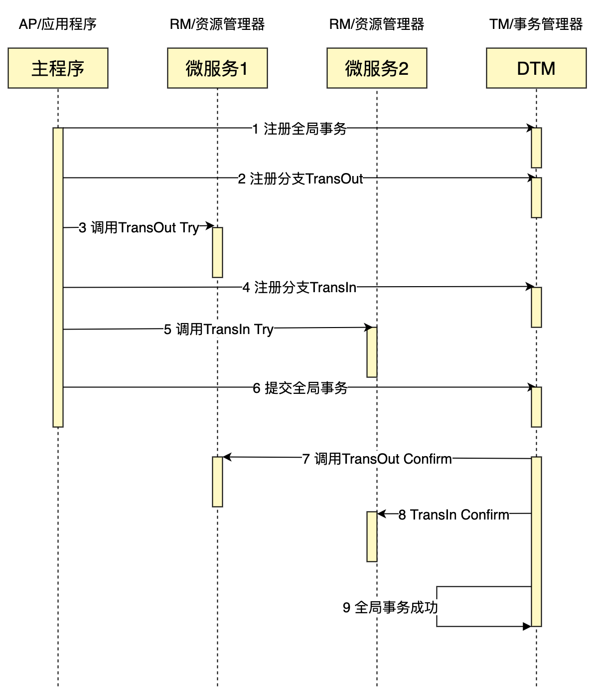
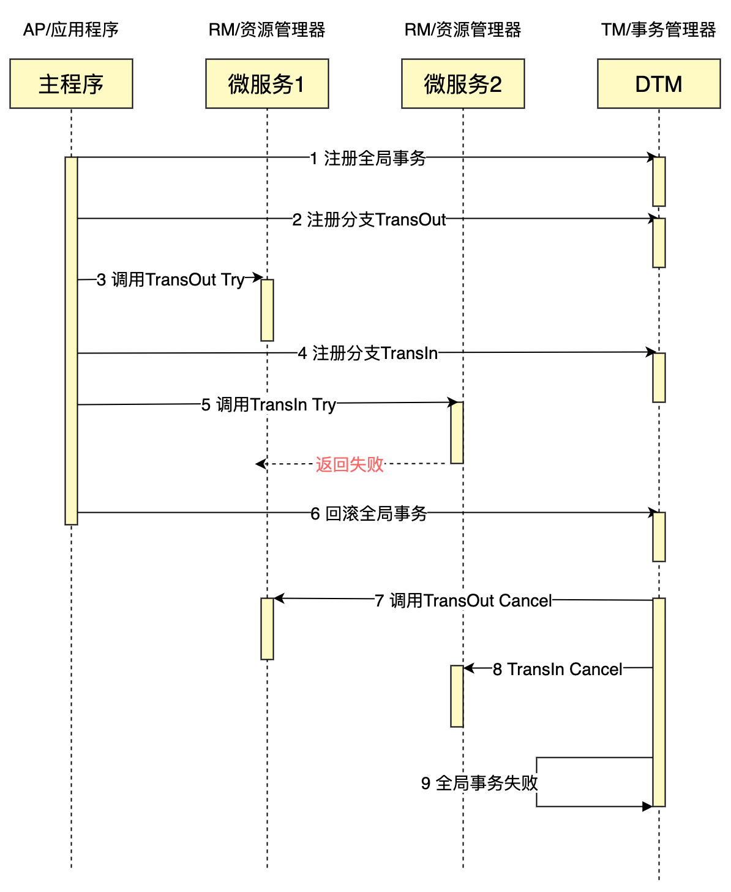

# 用Go轻松完成一个TCC分布式事务，保姆级教程
什么是TCC，TCC是Try、Confirm、Cancel三个词语的缩写，最早是由 Pat Helland 于 2007 年发表的一篇名为《Life beyond Distributed Transactions:an Apostate’s Opinion》的论文提出。

## TCC组成
TCC分为3个阶段

- Try 阶段：尝试执行，完成所有业务检查（一致性）, 预留必须业务资源（准隔离性）
- Confirm 阶段：如果所有分支的Try都成功了，则走到Confirm阶段。Confirm真正执行业务，不作任何业务检查，只使用 Try 阶段预留的业务资源
- Cancel 阶段：如果所有分支的Try有一个失败了，则走到Cancel阶段。Cancel释放 Try 阶段预留的业务资源。

TCC分布式事务里，有3个角色，与经典的XA分布式事务一样：

- AP/应用程序，发起全局事务，定义全局事务包含哪些事务分支
- RM/资源管理器，负责分支事务各项资源的管理
- TM/事务管理器，负责协调全局事务的正确执行，包括Confirm，Cancel的执行，并处理网络异常

如果我们要进行一个类似于银行跨行转账的业务，转出（TransOut）和转入（TransIn）分别在不同的微服务里，一个成功完成的TCC事务典型的时序图如下：


## TCC网络异常

TCC在整个全局事务的过程中，可能发生各类网络异常情况，典型的是空回滚、幂等、悬挂，由于TCC的异常情况，和SAGA、可靠消息等事务模式有相近的地方，因此我们把所有异常的解决方案统统放在这篇文章[《还被分布式事务的网络异常困扰吗？一个函数调用帮你搞定它》](https://zhuanlan.zhihu.com/p/388444465)进行讲解

## TCC实践

对于前面的跨行转账操作，最简单的做法是，在Try阶段调整余额，在Cancel阶段反向调整余额，Confirm阶段则空操作。这么做带来的问题是，如果A扣款成功，金额转入B失败，最后回滚，把A的余额调整为初始值。在这个过程中如果A发现自己的余额被扣减了，但是收款方B迟迟没有收到余额，那么会对A造成困扰。

更好的做法是，Try阶段冻结A转账的金额，Confirm进行实际的扣款，Cancel进行资金解冻，这样用户在任何一个阶段，看到的数据都是清晰明了的。

下面我们进行一个TCC事务的具体开发

目前可用于TCC的开源框架，主要为Java语言，其中以seata为代表。我们的例子采用go语言，使用的分布式事务框架为[https://github.com/yedf/dtm](https://github.com/yedf/dtm)，它对分布式事务的支持非常优雅。下面来详细讲解TCC的组成

我们首先创建两张表，一张是用户余额表，一张是冻结资金表，建表语句如下：


```
CREATE TABLE dtm_busi.`user_account` (
  `id` int(11) AUTO_INCREMENT PRIMARY KEY,
  `user_id` int(11) not NULL UNIQUE ,
  `balance` decimal(10,2) NOT NULL DEFAULT '0.00',
  `create_time` datetime DEFAULT now(),
  `update_time` datetime DEFAULT now()
);

CREATE TABLE dtm_busi.`user_account_trading` (
  `id` int(11) AUTO_INCREMENT PRIMARY KEY,
  `user_id` int(11) not NULL UNIQUE ,
  `trading_balance` decimal(10,2) NOT NULL DEFAULT '0.00',
  `create_time` datetime DEFAULT now(),
  `update_time` datetime DEFAULT now()
);
```

trading表中，trading_balance记录正在交易的金额。

我们先编写核心代码，冻结/解冻资金操作，会检查约束balance+trading_balance >= 0，如果约束不成立，执行失败


```
func adjustTrading(uid int, amount int) (interface{}, error) {
  幂等、悬挂处理
  dbr := sdb.Exec("update dtm_busi.user_account_trading t join dtm_busi.user_account a on t.user_id=a.user_id and t.user_id=? set t.trading_balance=t.trading_balance + ? where a.balance + t.trading_balance + ? >= 0", uid, amount, amount)
  if dbr.Error == nil && dbr.RowsAffected == 0 { // 如果余额不足，返回错误
    return nil, fmt.Errorf("update error, balance not enough")
  }
  其他情况检查及处理
}
```

然后是调整余额


```
func adjustBalance(uid int, amount int) (ret interface{}, rerr error) {
  幂等、悬挂处理
  这里略去进行相关的事务处理，包括开启事务，以及在defer中处理提交或回滚
  // 将原先冻结的资金记录解冻
  dbr := db.Exec("update dtm_busi.user_account_trading t join dtm_busi.user_account a on t.user_id=a.user_id and t.user_id=? set t.trading_balance=t.trading_balance + ?", uid, -amount)
  if dbr.Error == nil && dbr.RowsAffected == 1 { // 解冻成功
    // 调整金额
    dbr = db.Exec("update dtm_busi.user_account set balance=balance+? where user_id=?", amount, uid)
  }
  其他情况检查及处理
}
```

下面我们来编写具体的Try/Confirm/Cancel的处理函数


```
RegisterPost(app, "/api/TransInTry", func (c *gin.Context) (interface{}, error) {
  return adjustTrading(1, reqFrom(c).Amount)
})
RegisterPost(app, "/api/TransInConfirm", func TransInConfirm(c *gin.Context) (interface{}, error) {
  return adjustBalance(1, reqFrom(c).Amount)
})
RegisterPost(app, "/api/TransInCancel", func TransInCancel(c *gin.Context) (interface{}, error) {
  return adjustTrading(1, -reqFrom(c).Amount)
})

RegisterPost(app, "/api/TransOutTry", func TransOutTry(c *gin.Context) (interface{}, error) {
  return adjustTrading(2, -reqFrom(c).Amount)
})
RegisterPost(app, "/api/TransOutConfirm", func TransInConfirm(c *gin.Context) (interface{}, error) {
  return adjustBalance(2, -reqFrom(c).Amount)
})
RegisterPost(app, "/api/TransOutCancel", func TransInCancel(c *gin.Context) (interface{}, error) {
  return adjustTrading(2, reqFrom(c).Amount)
})

```
到此各个子事务的处理函数已经OK了，然后是开启TCC事务，进行分支调用


```
// TccGlobalTransaction 会开启一个全局事务
_, err := dtmcli.TccGlobalTransaction(DtmServer, func(tcc *dtmcli.Tcc) (rerr error) {
  // CallBranch 会将事务分支的Confirm/Cancel注册到全局事务上，然后直接调用Try
  res1, rerr := tcc.CallBranch(&TransReq{Amount: 30}, host+"/api/TransOutTry", host+"/api/TransOutConfirm", host+"/api/TransOutRevert"
  进行错误检查，以及其他逻辑
  res2, rerr := tcc.CallBranch(&TransReq{Amount: 30}, host+"/api/TransInTry", host+"/api/TransInConfirm", host+"/api/TransInRevert")
  进行错误检查，有任何错误，返回错误，回滚交易
  // 如果没有错误，函数正常返回后，全局事务会提交，TM会调用各个事务分支的Confirm，完成整个事务
})
```

至此，一个完整的TCC分布式事务编写完成。

如果您想要完整运行一个成功的示例，那么按照dtm项目的说明搭建好环境之后，运行下面命令运行tcc的例子即可

`go run app/main.go tcc_barrier`

## TCC的回滚
假如银行将金额准备转入用户2时，发现用户2的账户异常，返回失败，会怎么样？我们修改代码，模拟这种情况：
``` go
RegisterPost(app, "/api/TransInTry", func (c *gin.Context) (interface{}, error) {
  return gin.H{"dtm_result":"FAILURE"}, nil
})
```
这是事务失败交互的时序图


这个跟成功的TCC差别就在于，当某个子事务返回失败后，后续就回滚全局事务，调用各个子事务的Cancel操作，保证全局事务全部回滚。

## 小结

在这篇文章里，我们介绍了TCC的理论知识，也通过一个例子，完整给出了编写一个TCC事务的过程，涵盖了正常成功完成，以及成功回滚的情况。相信读者通过这边文章，对TCC已经有了深入的理解。

关于分布式事务中需要处理的幂等、悬挂、空补偿，请参考另一篇文章：[分布式事务你不能不知的坑，一个函数调用帮你搞定它](https://zhuanlan.zhihu.com/p/388444465)

关于分布式事务更多更全面的知识，请参考[分布式事务最经典的七种解决方案](https://segmentfault.com/a/1190000040321750)

文中使用的例子节选自[yedf/dtm](https://github.com/yedf/dtm)，支持多种事务模式：TCC、SAGA、XA、事务消息 跨语言支持，已支持 golang、python、PHP、nodejs等语言的客户端。提供子事务屏障功能，优雅解决幂等、悬挂、空补偿等问题。
​
阅读完此篇干货，欢迎大家访问[https://github.com/yedf/dtm](https://github.com/yedf/dtm)项目，给颗星星支持！