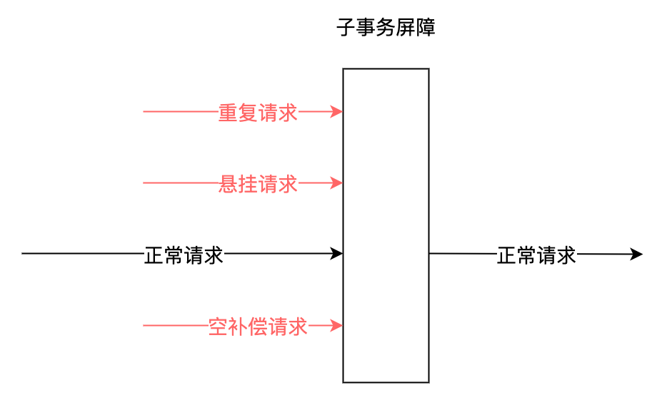

# 子事务屏障

## 功能

我们在dtm中，首创了子事务屏障技术，使用该技术，能够达到这个效果，看示意图：



所有这些请求，到了子事务屏障后：不正常的请求，会被过滤；正常请求，通过屏障。开发者使用子事务屏障之后，前面所说的各种异常全部被妥善处理，业务开发人员只需要关注实际的业务逻辑，负担大大降低。
子事务屏障提供了方法ThroughBarrierCall，方法的原型为：


``` go
func ThroughBarrierCall(db *sql.DB, transInfo *TransInfo, busiCall BusiFunc)
```

业务开发人员，在busiCall里面编写自己的相关逻辑，调用ThroughBarrierCall。ThroughBarrierCall保证，在空回滚、悬挂等场景下，busiCall不会被调用；在业务被重复调用时，有幂等控制，保证只被提交一次。

子事务屏障会管理TCC、SAGA、事务消息等，也可以扩展到其他领域

## 原理

子事务屏障技术的原理是，在本地数据库，建立分支事务状态表sub_trans_barrier，唯一键为全局事务id-子事务id-子事务分支名称（try|confirm|cancel）

- 开启事务
- 如果是Try分支，则那么insert ignore插入gid-branchid-try，如果成功插入，则调用屏障内逻辑
- 如果是Confirm分支，那么insert ignore插入gid-branchid-confirm，如果成功插入，则调用屏障内逻辑
- 如果是Cancel分支，那么insert ignore插入gid-branchid-try，再插入gid-branchid-cancel，如果try未插入并且cancel插入成功，则调用屏障内逻辑
- 屏障内逻辑返回成功，提交事务，返回成功
- 屏障内逻辑返回错误，回滚事务，返回错误

在此机制下，解决了网络异常相关的问题

- 空补偿控制--如果Try没有执行，直接执行了Cancel，那么Cancel插入gid-branchid-try会成功，不走屏障内的逻辑，保证了空补偿控制
- 幂等控制--任何一个分支都无法重复插入唯一键，保证了不会重复执行
- 防悬挂控制--Try在Cancel之后执行，那么插入的gid-branchid-try不成功，就不执行，保证了防悬挂控制

对于SAGA、事务消息，也是类似的机制。

## 小结

子事务屏障技术，为DTM首创，它的意义在于

- 算法简单易实现
- 系统统一的解决方案，易维护
- 提供了简单易用的接口，易使用

在这子事务屏障技术的帮助下，开发人员彻底的从网络异常的处理中解放出来。原先需要投入一位架构师处理这类异常，借助dtm的子事务屏障，只需要一个高级开发工程师就可以完成

该技术目前需要搭配DTM事务管理器，目前SDK已经提供给go语言的开发者。其他语言的sdk正在规划中。对于其他的分布式事务框架，只要提供了合适的分布式事务信息，也能够按照上述原理，快速实现该技术。
