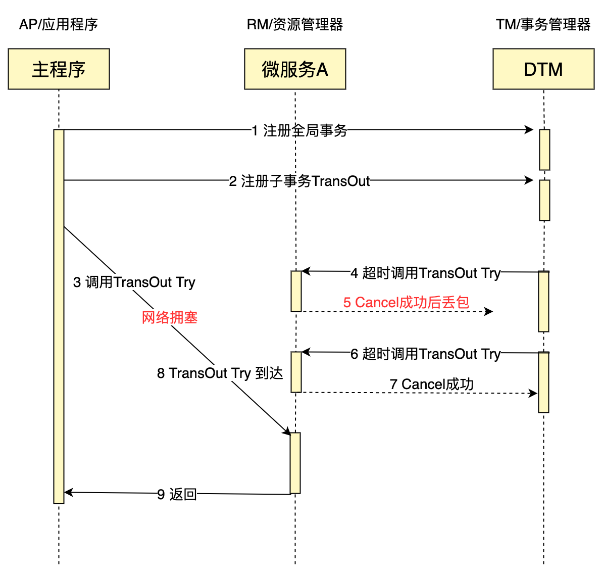

# 异常子事务屏障

## 异常分类

分布式事务是一个分布式系统，会遇见宕机、网络延迟等异常情况。这里面会有一部分对分布式事务造成影响，下面以TCC事务说明这些需要处理的异常情况：

**空回滚：** 在没有调用 TCC 的 Try 方法的情况下，调用了二阶段的 Cancel 方法。Cancel 方法需要识别出这是一个空回滚，然后直接返回成功。

**幂等：** 由于任何一个请求都可能出现网络异常，出现重复请求，所有的分布式事务分支操作，都需要保证幂等性

**悬挂：** 悬挂就是对于一个分布式事务，其二阶段 Cancel 接口比 Try 接口先执行。Try 方法需要识别出这是一个悬挂，然后直接返回失败。

## 异常原因

下面看一个网络异常的时序图，更好的理解上述几种问题



- 业务处理请求4的时候，Cancel在Try之前执行，需要处理空回滚
- 业务处理请求6的时候，Cancel重复执行，需要幂等
- 业务处理请求8的时候，Try在Cancel后执行，需要处理悬挂

## 异常难题

面对上述复杂的网络异常情况，目前看到各个分布式事务框架给出的建议方案主要是：

> 业务方通过唯一键，查询相关联的操作是否已完成，如果已完成则直接返回成功。

对于上述方案，每个业务都需要单独处理，相关的判断逻辑较复杂，易出错，业务负担重，是落地分布式事务的痛点。这里有一篇文章深入探讨这个问题，可以参考：[分布式事务的这些常见用法都有坑，来看看正确姿势](https://segmentfault.com/a/1190000041031586)

## 子事务屏障

我们在dtm中，首创了子事务屏障技术，使用该技术，能够非常便捷的解决异常问题，极大的降低了分布式事务的使用门槛。

子事务屏障能够达到下面这个效果，看示意图：


所有这些请求，到了子事务屏障后：不正常的请求，会被过滤；正常请求，通过屏障。开发者使用子事务屏障之后，前面所说的各种异常全部被妥善处理，业务开发人员只需要关注实际的业务逻辑，负担大大降低。
子事务屏障提供了方法BranchBarrier.Call，方法的原型为：


``` go
func (bb *BranchBarrier) Call(db *sql.DB, busiCall BusiFunc) error
```

业务开发人员，在busiCall里面编写自己的相关逻辑，调用BranchBarrier.CallWithDB。BranchBarrier.Call保证，在空回滚、悬挂等场景下，busiCall不会被调用；在业务被重复调用时，有幂等控制，保证只被提交一次。

子事务屏障会管理TCC、SAGA、事务消息等，也可以扩展到其他领域

## 原理

子事务屏障技术的原理是，在本地数据库，建立分支操作状态表dtm_barrier，唯一键为全局事务id-分支id-分支操作（try|confirm|cancel）

1. 开启本地事务
2. 对于当前操作op(try|confirm|cancel)，insert ignore一条数据gid-branchid-op，如果插入不成功，提交事务返回成功（常见的幂等控制方法）
3. 如果当前操作是cancel，那么在insert ignore一条数据gid-branchid-try，如果插入成功（注意是成功），则提交事务返回成功
4. 调用屏障内的业务逻辑，如果业务返回成功，则提交事务返回成功；如果业务返回失败，则回滚事务返回失败

在此机制下，解决了网络异常相关的问题

- 空补偿控制--如果Try没有执行，直接执行了Cancel，那么3中Cancel插入gid-branchid-try会成功，不走屏障内的逻辑，保证了空补偿控制
- 幂等控制--2中任何一个操作都无法重复插入唯一键，保证了不会重复执行
- 防悬挂控制--Try在Cancel之后执行，那么Cancel会在3中插入gid-branchid-try，导致Try在2中不成功，就不执行屏障内的逻辑，保证了防悬挂控制

对于SAGA、事务消息，也是类似的机制。

## 结合常见的orm库

barrier提供了sql标准接口，但大家的应用通常都会引入更高级的orm库，而不是裸用sql接口，因此需要进行转化. 相关的对接参考[对接ORM](../summary/db)

## 小结

子事务屏障技术，为DTM首创，它的意义在于

- 算法简单易实现
- 系统统一的解决方案，易维护
- 提供了简单易用的接口，易使用

在这子事务屏障技术的帮助下，开发人员彻底的从网络异常的处理中解放出来。原先需要投入一位架构师处理这类异常，借助dtm的子事务屏障，只需要一个高级开发工程师就可以完成

该技术目前需要搭配DTM事务管理器，目前SDK已经提供给Go、Java、Python语言的开发者。其他语言的sdk正在规划中。对于其他的分布式事务框架，只要提供了合适的分布式事务信息，也能够按照上述原理，快速实现该技术。
