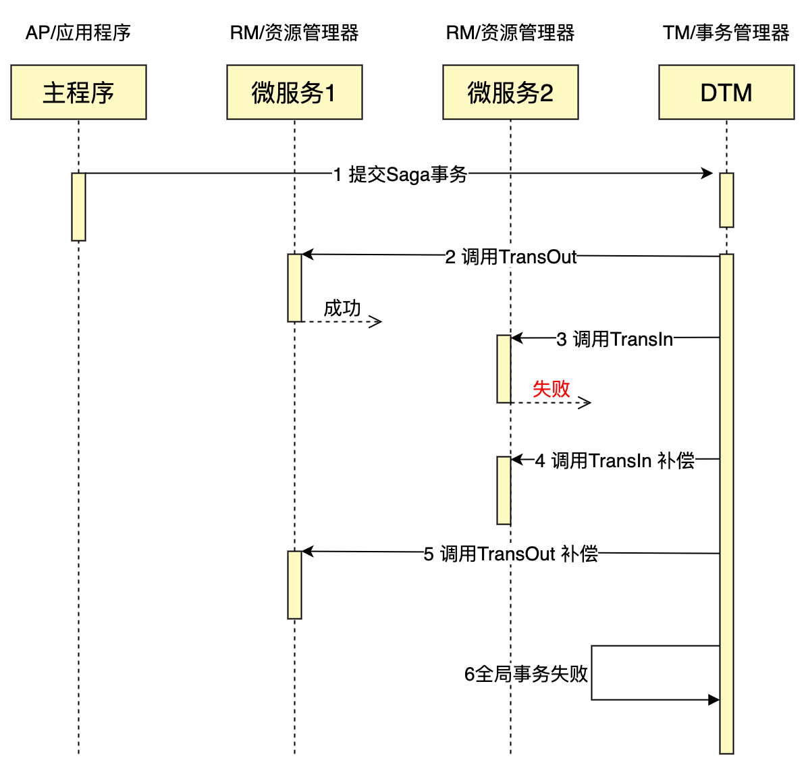

# 介绍

## DTM是什么

DTM是一款开源的分布式事务管理器，解决跨数据库、跨服务、跨语言栈更新数据的一致性问题。

通俗一点说，DTM提供跨服务事务能力，一组服务要么全部成功，要么全部回滚，避免只更新了一部分数据产生的一致性问题。

您可以在[为什么选DTM](./why)中了解更多DTM的设计初衷。

## 谁在使用dtm

[Tencent 腾讯](../other/using#tencent)

[ByteDance 字节](../other/using#bytedance)

[360](../other/using#360)

[更多](../other/using)

## 快速开始

::: tip 具备的基础知识
本教程也假设您有一定的编程基础，能够大致明白GO语言代码的意思，如果您在阅读Go代码方面遇见问题，可以访问[golang](https://golang.google.cn/)
:::

如果您不是Go语言，不熟悉Go环境，您可以转到[SDK](../ref/sdk#go)，找到对应语言的QuickStart

#### 运行dtm

``` bash
git clone https://github.com/dtm-labs/dtm && cd dtm
go run main.go
```

#### 启动并运行一个saga示例
下面运行一个类似跨行转账的示例，包括两个事务分支：资金转出（TransOut)、资金转入（TransIn)。DTM保证TransIn和TransOut要么全部成功，要么全部回滚，保证最终金额的正确性。

`go run qs/main.go`

## 示例详解

#### 接入代码
``` GO
  // 具体业务微服务地址
  const qsBusi = "http://localhost:8081/api/busi_saga"
  req := &gin.H{"amount": 30} // 微服务的载荷
  // DtmServer为DTM服务的地址，是一个url
  DtmServer := "http://localhost:36789/api/dtmsvr"
  saga := dtmcli.NewSaga(DtmServer, shortuuid.New()).
    // 添加一个TransOut的子事务，正向操作为url: qsBusi+"/TransOut"， 补偿操作为url: qsBusi+"/TransOutCompensate"
    Add(qsBusi+"/TransOut", qsBusi+"/TransOutCompensate", req).
    // 添加一个TransIn的子事务，正向操作为url: qsBusi+"/TransIn"， 补偿操作为url: qsBusi+"/TransInCompensate"
    Add(qsBusi+"/TransIn", qsBusi+"/TransInCompensate", req)
  // 提交saga事务，dtm会完成所有的子事务/回滚所有的子事务
  err := saga.Submit()
```

成功运行后，可以看到TransOut、TransIn依次被调用，完成了整个分布式事务

#### 时序图
整个事务最终成功完成，时序图如下：


#### 失败情况
在实际的业务中，子事务可能出现失败，例如转入的子账号被冻结导致转账失败。我们对业务代码进行修改，让TransIn的正向操作失败，然后看看结果

``` go
	app.POST(qsBusiAPI+"/TransIn", func(c *gin.Context) {
		log.Printf("TransIn")
		c.JSON(409, "") // Status 409 表示失败，不再重试，直接回滚
	})
```

再运行这个例子，整个事务最终失败，时序图如下：



在转入操作失败的情况下，TransIn和TransOut的补偿操作被执行，保证了最终的余额和转账前是一样的。

## 准备好了吗？

我们刚才简单介绍了一个完整的分布式事务，包括了一个成功的，以及一个回滚的。现在您应该对分布式事务有了具体的认识，本教程将带你逐步学习分布式事务的原理，然后是具体的技术方案和技巧。

## 交流群

请加 yedf2008 好友或者扫码加好友，验证回复 dtm 按照指引进群


如果您觉得[dtm](https://github.com/dtm-labs/dtm)不错，或者对您有帮助，请赏颗星吧！
