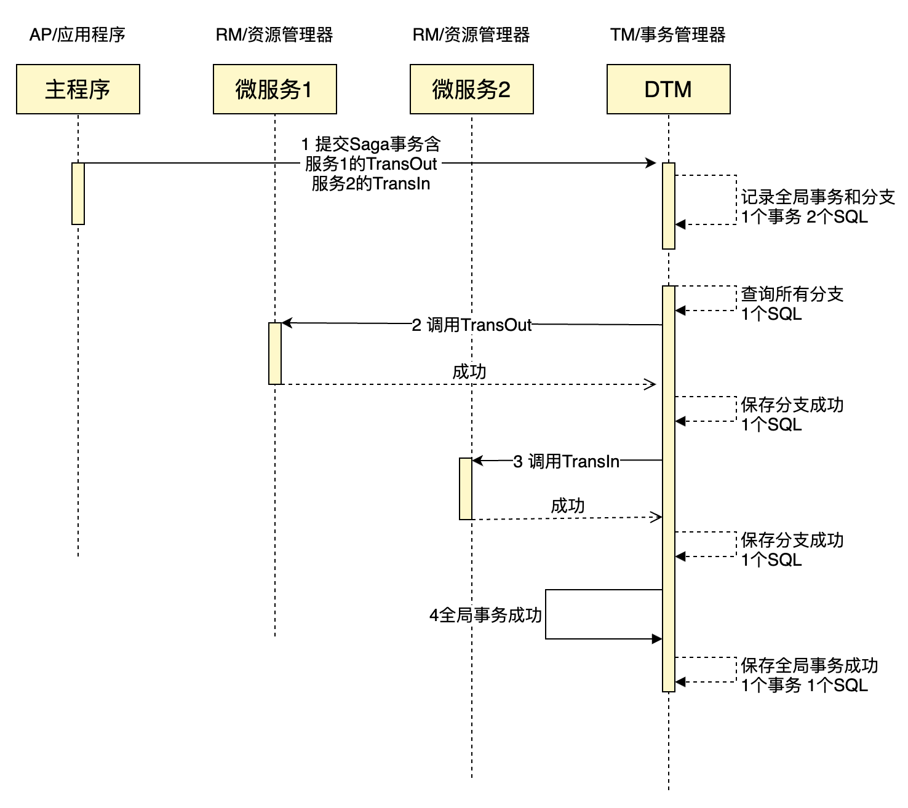

# DTM性能测试报告

因为其他的分布式事务框架没有官方的性能测试报告，所以没有与其他框架的对比数据。但我们做了dtm的性能与mysql的理想性能对比分析，分析结果显示dtm的额外开销很小，主要性能瓶颈在数据库的事务能力和sql吞吐量

## 测试环境

|  机型| CPU/内存 | 存储 |系统|Mysql|
|:-----:|:----:|:----:|:----:|:----:|
| 阿里云ecs.c7.xlarge | 4核8G | 500G ESSD IOPS 26800|Ubuntu 20.04|Docker mysql:5.7|

## 测试过程

``` bash
# 在dtm目录下
git checkout fec4957
docker-compose -f helper/compose.mysql.yml up -d # 启动Mysql

# 运行sysbench对mysql进行测试
sysbench oltp_write_only.lua --time=60 --mysql-host=127.0.0.1 --mysql-port=3306 --mysql-user=root --mysql-password= --mysql-db=sbtest --table-size=1000000 --tables=10 --threads=10 --events=999999999 --report-interval=10 prepare
sysbench oltp_write_only.lua --time=60 --mysql-host=127.0.0.1 --mysql-port=3306 --mysql-user=root --mysql-password= --mysql-db=sbtest --table-size=1000000 --tables=10 --threads=10 --events=999999999 --report-interval=10 run

go run app/main.go bench > /dev/nul # 启动dtm的bench服务，日志较多，重定向到nul设备
bench/run-dtm.sh # 新启动命令行，运行dtm相关的各项测试
```

PS：如果您需要动手进行测试，建议您购买香港或国外的主机，这样相关的github、docker访问会快很多，能够快速搭建好环境。我在国内购买的主机，访问github和docker，非常慢，有时连接不上，无法顺畅进行测试。

## 测试指标

我们会对以下几个指标进行对比：

- Global-TPS：用户视角下，完成了多少个全局事务。
- DB-TPS：各项测试中，在DB层面完成的事务数量
- OPS：各项测试中，完成了多少个SQL语句

## 结果对比

| |Mysql|无DTM-2SQL|DTM-0SQL|DTM-2SQL|DTM-2SQL-Barrier|无DTM-10SQL|DTM-10SQL|DTM-10SQL-Barrier|
|:---:|:---:|:---:|:---:|:---:|:---:|:---:|:---:|:---:|
|Global-TPS|-|1232|935|575|531|551|357|341|
|DB-TPS|2006|2464|1870|2300|2124|1102|1428|1364|
|OPS|12039|4928|5610|5750|6372|10620|9282|9548|

## Mysql性能

我们首先用测试了Mysql自身的性能。在DTM的这次性能测试中，写操作较多，因此我们这次主要对Mysql的写进行了性能测试。

我们采用了sysbench中的oltp_write_only基准，在这个基准中，每个事务包含6个写SQL（有insert/update/delete）。

在这个基准下，每秒完成的事务数量大约为2006，完成SQL数量大约为为12039。这两项结果，会在后续的DTM相关测试中引用。

## DTM测试

分布式事务中涉及的事务模式有多种，我们选取一个有代表性的简单Saga模式作为代表，分析分布式事务DTM的性能。

我们选取的Saga事务，包含两个子事务，一个是TransOut转出余额，一个是TransIn转入余额。转入转出各包含两个Sql，分别是更新余额和记录流水。

### 无DTM-2SQL

我们首先测试不采用DTM的情况，也就是直接调用TransOut和TransIn，测试结果是每秒完成了1232个全局事务。每个全局事务包含转出和转入两个子事务，因此DB-TPS为2464，然后每个子事务又包含两个SQL，因此总的SQL操作为4928。

这个结果对比MYSQL，DB-TPS更高，而DB-SQL只有一半，主要原因为每个事务都需要将数据同步到磁盘，需要额外消耗性能，此时瓶颈主要在系统数据库的事务能力

### DTM-0SQL

我们接着测试采用DTM的情况，采用了DTM之后，一个SAGA事务的时序图如下：



全局事务中DTM会包括2个事务：保存全局事务+分支操作、修改全局事务为已完成。将每个事务分支操作修改为已完成也各需要一个事务，但DTM采用异步写进行了合并，减少了事务。

每个全局事务中dtm包括的SQL数量为：1个保存全局事务、1个保存分支操作、1个读所有分支操作、2个修改分支操作为完成、1个修改全局事务为完成，一共6个SQL。

测试结果中，每秒完成全局事务数为935，那么DB-TPS为1870，OPS为5610。从这个结果看，一台4核8G机器上的mysql，能够承载935的每秒事务量，足够绝大部分公司使用了。

### DTM-2SQL

如果我们把业务中的SQL也包含进来，计算采用分布式事务方案后的总吞吐变化，那么

全局事务会包括dtm的2个事务，以及TransIn、TransOut两个业务事务，一共是4个事务。

全局事务包括的SQL数量为：6个dtm的SQL，加上业务子事务的4个SQL是10个。

测试结果中，每秒完成全局事务数为575，那么DB-TPS为2300，OPS为5750，对比前面不采用DTM的方案，DB-TPS略有下降，OPS有一定的上升，瓶颈还是在系统数据库

### DTM-2SQL-Barrier

加入了子事务屏障后，每个事务分支操作会多一个insert语句，每个全局事务对应的SQL数量为12.

测试结果中，每秒完成全局事务数为531，那么DB-TPS为2124，OPS为6372，对比前面DTM的方案，DB-TPS略有下降，OPS略有上升，符合预期

### 无DTM-10SQL

我们对压测的数据做调整，将每个子事务里的SQL数量，从2调整为10，将子事务中的SQL循环执行5次。

无DTM的压测结果中，每秒完成的全局事务数为551，DB-TPS为1102，OPS为10620。这个结果中，OPS与MYSQL的接近，瓶颈主要在数据库的OPS。

### DTM-10SQL

这个压测结果中，每秒完成的全局事务数为357，DB-TPS为1428，OPS为9282，其中OPS比无DTM的情况下降了百分之十几，主要原因为DTM的表，有较多的字段及索引，每个SQL的执行开销会大一些，因此总OPS会更低。

### DTM-10SQL-Barrier

测试结果中，每秒完成全局事务数为341，那么DB-TPS为1364，OPS为9548，对比前面DTM的方案，DB-TPS略有下降，OPS略有上升，符合预期

## 小结

从DTM的压测结果与MYSQL的压测数据对比来看，DTM产生的额外开销很小，已经最大化的利用了数据库的能力。

一台ecs.c7.xlarge+500G磁盘的阿里云服务器，安装mysql后，大约能够提供300~600的Global-TPS，每月费用为900元（2021年10月价格），这个成本对比提供的业务能力来说，已经很低了。

如果您需要更强劲的性能，可以购买更高配的配置，也可以在应用层部署多组DTM，两种方案的代价并不大，足以满足绝大部分公司的需求。
