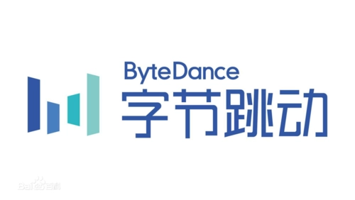
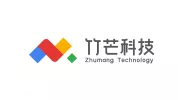

# 谁在用

如果您正在使用dtm，请帮忙在[这个链接](https://github.com/dtm-labs/dtm/issues/7)添加一个评论，帮助我们更好的扩散dtm。

## 典型案例

### 腾讯 {#tencent}
腾讯内部有多个事业部使用了dtm，涵盖许多业务场景。

dtm合并了多个腾讯同学提过来的PR，特性包括uber automaxprocs, MaxOpenConns, Polaris等等，特别感谢腾讯的同学们

dtm的这几个特性是优先考虑腾讯同学的需求开发的：
- 日志采用uber zap
- Redis存储引擎
- 并发Saga
- 自定义Header支持

[公司官网](https://www.tencent.com)

### 字节 {#bytedance}
字节内部某部门将dtm应用于环境的自动搭建。搭建环境是一个需要多处协调，耗时较长，中途容易出现中断的应用场景，通过引入dtm，做到了以下几点：

- 通过dtm，避免环境搭建处于搭建一半的状态，做到最后要么搭建成功，要么全部被清理
- 通过子事务屏障，避免部分环节被并发重入，导致问题
- 通过dtm的重试，保证出错回滚的情况下，一定会有一个清理任务最终成功完成

[公司官网](https://www.bytedance.com)

### 360 {#360}
360 公司的新交易平台使用了dtm，详细的使用情况参考这篇文章 [DTM在新交易平台的落地](https://mp.weixin.qq.com/s/iG9eKnZEdYCIVriktiXdYw)

[公司官网](https://www.360.cn/)

## 谁在使用

下面仅包含部分使用者

    
    
    
    
    
    
    
    

