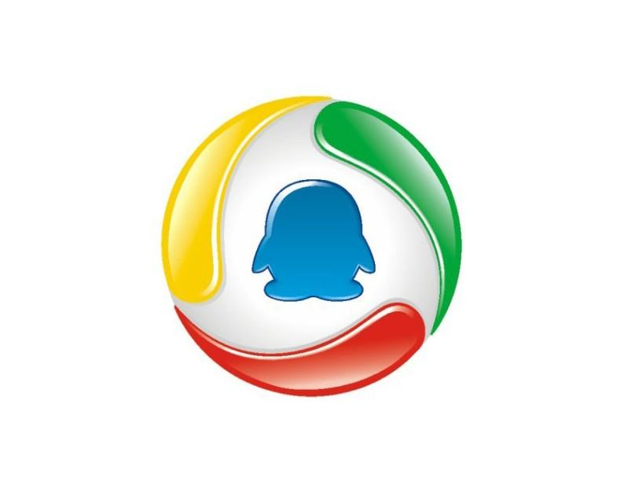

# 谁在用

如果您正在使用dtm，请帮忙在[这个链接](https://github.com/dtm-labs/dtm/issues/7)添加一个评论，帮助我们更好的扩散dtm。

## 典型案例

### 腾讯 {#tencent}
腾讯内部有多个事业部使用了dtm，涵盖许多业务场景。

dtm合并了多个腾讯同学提过来的PR，特性包括uber automaxprocs, MaxOpenConns, Polaris等等，特别感谢腾讯的同学们

dtm的这几个特性是优先考虑腾讯同学的需求开发的：
- 日志采用uber zap
- Redis存储引擎
- 并发Saga
- Header支持（开发中）

[公司官网](https://www.tencent.com)
### 常青藤爸爸 {#ivydad}
这是一家B轮在线教育公司，我之前在这担任CTO

dtm最早解决的需求来自于常青藤爸爸，当时调研完市场情况，做了初步的架构设计之后，就认为go领域的分布式事务是强需求，我们的架构设计，我们的许多创新在业内非常先进，将dtm开源会让dtm获得很好的发展

当时常青藤爸爸的一个重要需求是：单体订单系统扣库存支持的并发度很低，大约20单每秒。虽然可以通过拆分微服务，提高并发量，但是一致性难以保证。市场上只有Java有成熟方案，以Seata为代表。我们把服务端语言切成Java的工作量太大，因此需要一个新的方案，因而诞生了dtm。

[公司官网](https://www.ivydad.com)

## 谁在使用

下面仅包含部分使用者

    
    
    
    
    

