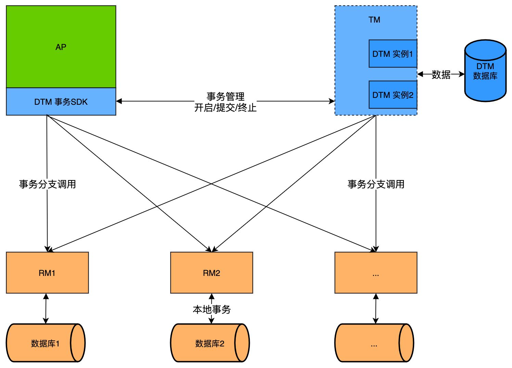
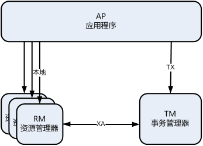

# DTM架构

我们先简单介绍一个完整的分布式事务，大家了解了分布式事务的过程后，再详细介绍DTM的架构。

## 分布式事务过程

假设我们要进行一个跨行转账，A转给B30元，因为A、B不在同一个数据库，无法通过本地事务解决，因此使用了SAGA分布式事务来解决这个问题，下面是一个成功的SAGA事务（更多SAGA详情，参考[SAGA](./saga)）的时序图：

整个全局事务分为如下几步：
1. 用户定义好全局事务所有的事务分支，包括action/compensate，然后提交给DTM，DTM持久化全局事务信息后，立即返回
2. DTM取出第一个事务分支，这里是TransOut，调用该服务，该服务成功返回
3. DTM取出第二个事务分支，这里是TransIn，调用该服务，该服务也成功返回
4. DTM已完成所有的事务分支，将全局事务的状态，修改为已完成

在理解了上述的这个时序图的基础上，我们来看dtm的架构

## DTM架构图

整个DTM架构中，一共有三个角色，分别承担了不同的功能

- RM-资源管理器：RM是一个应用服务，负责管理全局事务中的本地事务，他通常会连接到一个数据库，负责相关数据的修改、提交、回滚、补偿等操作。例如在前面的这个SAGA事务中，步骤2、3中被调用的TransIn，TransOut服务都是RM，业务上负责A、B账户余额的修改
- AP-应用程序：AP是一个应用服务，负责全局事务的编排，他会注册全局事务，注册子事务，调用RM接口。例如在前面的这个SAGA事务中，发起步骤1的是AP，它编排了一个包含TransOut、TransIn的全局事务，然后提交给TM
- TM-事务管理器：TM就是DTM服务，负责全局事务的管理，每个全局事务都注册到TM，每个事务分支也注册到TM。TM会协调所有的RM，将同一个全局事务的不同分支，全部提交或全部回滚。例如在前面的SAGA事务中，TM在步骤2、3中调用了各个RM，在步骤4中，完成这个全局事务

这里的角色划分中，有时候一个服务可能会同时承担AP和RM的功能，例如后续讲到的嵌套TCC情况。

## 跨语言特性
dtm本身由Go编写，他提供了多语言分布式事务的支持，为什么DTM支持了多语言，而其他的分布式事务框架，目前未看到多语言支持呢？

目前看到其他框架中，在SDK层的设计里，都比较重，包括的逻辑多，还有部分框架在SDK层实现了自定义的XA协议，因此整个SDK很重，拓展到更多语言，需要大量大量的工作。

而在上述DTM的架构中，SDK是AP中的蓝色部分，他在设计之初，定位就是很薄的一层，主要功能就是调用HTTP/gRPC协议通信，加上一些ID生成等。对于一门新语言，开发一个简单可用的SDK，一般只需要几十行到几百行的代码。目前dtm-labs下，已经有多门语言的SDK了，详情参见[多语言SDK](../ref/sdk)

## 高可用
在上述这个架构中，TM不是单点，而是一个服务集群。集群由多个dtm实例进程构成，多个dtm实例访问一个共享的高可用数据库（可以选Redis/Mysql/Postgres）。

几乎所有的云厂商都会提供高可用的数据库，几乎所有要求业务高可用的公司内部，都会有高可用的数据库，因此将dtm对接到一个高可用数据库是毫无困难的。

在实际的生产部署中，DTM是多实例的，连接的共享存储是高可用的，因此不存在单点，从而提供了高可用的DTM服务。

## 多进程同时轮询

全局事务的运行过程中，可能出现各种网络错误，导致全局事务无法一次完成，需要定时重试。

DTM（默认配置下）会在每个进程实例中，去轮询超时需要处理的全局任务。为了保证上述高可用多进程部署中，一个超时任务不会被多个实例同时取出，dtm使用了类似乐观锁的机制，保证一个任务只会被一个dtm实例取出。

- **DB存储引擎：** 采用update ... set owner=..., time=... where ... 这种方式，因为update的原子性，能够保证一条记录只被一个实例更新
- **Redis存储引擎：** 采用lua脚本原子操作，保证一条记录只被一个实例取出

## 术语
DTM在分布式事务的理论与实践中，常常会提到一些专业术语，下面定义这些术语：
- 事务分支：我们把每个服务管理的全局事务组成部分，称为事务分支，例如前面的转账，分为转出和转入两个事务分支
- 分支操作：每个事务分支，在SAGA、XA、TCC等事务模式下，会有多个操作，例如转出事务分支，包括正弦操作TransOut和TransOutCompensate
- 本地事务：转出事务分支中的正向操作，通常会开启一个事务，对余额进行扣减，我们将数据操作的这个事务，称为本地事务
- GID：全局事务ID，用于标记全局事务，必须唯一。该ID可以采用UUID生成，也可以使用业务上的ID，例如订单ID等

## 接口协议 {#proto}

目前dtm只支持http和grpc协议，以及在这基础上的部分微服务协议。由于分布式事务涉及多个角色协作，某些参与者可能出现暂时不可用或者返回500等异常情况是不可避免的。这些暂时不可用和500，与业务上的失败有非常大的区别。

::: warning 接口错误与业务失败
例如前面的转出金额操作，如果遇见暂时不可用，或者500，此时不应当认为转账失败，而进行回滚。

有个dtm的用户，在未使用分布式事务的旧系统中，曾经遇到过这类事故，起因是开发人员在调用发红包后，因为调用超时，认为发红包失败，没有扣减用户的余额，但是当红包服务恢复正常后，发现红包已发出，这就导致了金额错误，造成了事故。

因此进行分布式事务开发时，切记 **接口返回错误 不等于 业务失败**
:::

对于上述的 ”暂时不可用“ 及 ”500“，DTM 会进行重试。而对于成功或失败等确定的结果，则会更新分布式事务的进度。

dtm系统中，调用分支事务的服务，有四种结果：
- **SUCCESS:** 表示成功
- **FAILURE:** 表示失败，这个失败是指确定的失败结果，不需要重试。例如子事务因转账余额不足而失败，dtm服务因为事务已完成不允许再次提交等
- **ONGOING:** 表示未完成，还在正常进行中，此时dtm服务器需要采用固定间隔重试，而不是指数退避算法重试
- **其他:** 表示临时错误，采用指数退避算法重试，避免出现故障或者bug，导致大量重试，导致负载过高

::: tip ONGOING
DTM 引入了一个特殊的结果 ONGOING，当 DTM 收到这个返回值时，认为这个子事务操作还在正常进行中，还未完成，需要进行重试。假如你需要预定旅游出行的机票，第三方可能需要1个小时才能够确认机票预定的结果，那么应用可以指定分布式事务的重试间隔时间，并在未获得确定结果时，返回 ONGOING，这样 DTM 会按照固定间隔时间重试。详情可以参见 [SAGA](../practice/saga)
:::
下面分别说明 HTTP 和 gRPC 中，如何表示含义明确的三种结果
#### HTTP
- **SUCCESS:** 状态码 200 StatusOK
- **FAILURE:** 状态码 409 StatusConflict
- **ONGOING:** 状态码 425 StatusTooEarly

#### gRPC
- **SUCCESS:** 状态码 OK
- **FAILURE:** 状态码 Aborted
- **ONGOING:** 状态码 FailedPrecondition

以上 HTTP 和 gRPC 的几个结果定义，对于云原生上的重试策略是友好兼容的，默认情况下，如果微服务配置了重试策略，那么对于其他结果（通常为 HTTP 502 或者 gRPC Unavailable）会进行重试，而确定的结果，则不会被云原生上的重试策略重试。

::: tip 接口协议变更
dtm的接口协议在 1.10.0进行了变更升级，升级的同时保持了与旧版本的兼容，详情参见[升级指南](../deploy/upgrade)
:::

## 与XA DTP模型异同
DTM的架构和角色，与X/Open XA的DTP模型一致，RM、AP、TM担当的功能都是一致的，只是将XA的DTP模型拓展到了服务/微服务架构上。

DTM对比了其他事务框架的角色划分和DTP的角色划分，认为DTP在总体架构，依旧能够适用于跨服务这种分布式事务形式，因此保留了AP、RM、TM的划分

主要区别如下：
- TM不再是单点，而是集群部署，本身就具备高可用。原先2PC中的单点问题，就被集群化的dtm实例+共享的高可用存储解决了。这其中没有复杂的选举过程，而是依赖云服务上提供的高可用共享存储引擎（云服务商户进行故障重新选举，用户不用关心）
- RM不是直接的数据库，而是服务，服务的与他背后数据库交互。TM与RM服务交互，而不会与数据库直接交互
- AP不是直接的本地程序，而是服务，他对RM的访问，是通过网络的api请求，而不是本地SDK调用。

## 小结
DTM的整体架构具备高可用，易扩容等特点，复杂性都在内部解决，暴露给用户的是非常简单易上手的形式。