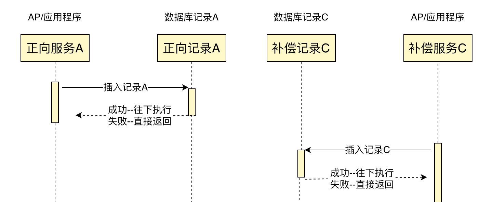

# 异常与子事务屏障

分布式事务之所以难，主要是因为分布式系统中的各个节点都可能发生各种非预期的情况。本文先介绍分布式系统中的异常问题，然后介绍这些问题带给分布式事务的挑战，接下来指出现有各种常见用法的问题，最后给出正确的方案。

## NPC的挑战
分布式系统最大的敌人可能就是NPC了，在这里它是Network Delay, Process Pause, Clock Drift的首字母缩写。我们先看看具体的NPC问题是什么：

- Network Delay，网络延迟。虽然网络在多数情况下工作的还可以，虽然TCP保证传输顺序和不会丢失，但它无法消除网络延迟问题。
- Process Pause，进程暂停。有很多种原因可以导致进程暂停：比如编程语言中的GC（垃圾回收机制）会暂停所有正在运行的线程；再比如，我们有时会暂停云服务器，从而可以在不重启的情况下将云服务器从一台主机迁移到另一台主机。我们无法确定性预测进程暂停的时长，你以为持续几百毫秒已经很长了，但实际上持续数分钟之久进程暂停并不罕见。
- Clock Drift，时钟漂移。现实生活中我们通常认为时间是平稳流逝，单调递增的，但在计算机中不是。计算机使用时钟硬件计时，通常是石英钟，计时精度有限，同时受机器温度影响。为了在一定程度上同步网络上多个机器之间的时间，通常使用NTP协议将本地设备的时间与专门的时间服务器对齐，这样做的一个直接结果是设备的本地时间可能会突然向前或向后跳跃。

分布式事务既然是分布式的系统，自然也有NPC问题。因为没有涉及时间戳，带来的困扰主要是NP。

## 异常分类

我们以分布式事务中的TCC作为例子，看看NP带来的影响。

一般情况下，一个TCC回滚时的执行顺序是，先执行完Try，再执行Cancel，但是由于N，则有可能Try的网络延迟大，导致先执行Cancel，再执行Try。

这种情况就引入了分布式事务中的两个难题：
- **空补偿：** Cancel执行时，Try未执行，事务分支的Cancel操作需要判断出Try未执行，这时需要忽略Cancel中的业务数据更新，直接返回
- **悬挂：** Try执行时，Cancel已执行完成，事务分支的Try操作需要判断出Cancel已执行，这时需要忽略Try中的业务数据更新，直接返回

分布式事务还有一类需要处理的常见问题，就是重复请求
- **幂等：** 由于任何一个请求都可能出现网络异常，出现重复请求，所有的分布式事务分支操作，都需要保证幂等性

因为空补偿、悬挂、重复请求都跟NP有关，我们把他们统称为子事务乱序问题。在业务处理中，需要小心处理好这三种问题，否则会出现错误数据。

## 异常原因

下面看一个网络异常的时序图，更好的理解上述几种问题


- 业务处理请求4的时候，Cancel在Try之前执行，需要处理空回滚
- 业务处理请求6的时候，Cancel重复执行，需要幂等
- 业务处理请求8的时候，Try在Cancel后执行，需要处理悬挂

## 现有方案的问题
我们看到开源项目dtm之外，包括各云厂商，各开源项目，他们给出的业务实现建议大多类似如下（这也是大多数用户最容易想到的方案）：

- **空补偿：** “针对该问题，在服务设计时，需要允许空补偿，即在没有找到要补偿的业务主键时，返回补偿成功，并将原业务主键记录下来，标记该业务流水已补偿成功。”
- **防悬挂：** “需要检查当前业务主键是否已经在空补偿记录下来的业务主键中存在，如果存在则要拒绝执行该笔服务，以免造成数据不一致。”

上述的这种实现，能够在大部分情况下正常运行，但是上述做法中的“先查后改”在并发情况下是容易掉坑里的，我们分析以下如下场景：

- 正常执行顺序下，Try执行时，在查完没有空补偿记录的业务主键之后，事务提交之前，如果发生了进程暂停P，或者事务内部进行网络请求出现了拥塞，导致本地事务等待较久
- 全局事务超时后，Cancel执行，因为没有查到要补偿的业务主键，因此判断是空补偿，返回
- Try的进程暂停结束，最后提交本地事务
- 全局事务回滚完成后，Try分支的业务操作没有被回滚，产生了悬挂

事实上，NPC里的P和C，以及P和C的组合，有很多种的场景，都可以导致上述竞态情况，就不一一赘述了。

虽然这种情况发生的概率不高，但是在金融领域，一旦涉及金钱账目，那么带来的影响可能是巨大的。

PS：幂等控制如果也采用“先查再改”，也是一样很容易出现类似的问题。解决这一类问题的关键点是要利用唯一索引，“以改代查”来避免竞态条件。

## 子事务屏障

我们在dtm中，首创了子事务屏障技术，使用该技术，能够非常便捷的解决异常问题，极大的降低了分布式事务的使用门槛。

子事务屏障能够达到下面这个效果，看示意图：


所有这些请求，到了子事务屏障后：不正常的请求，会被过滤；正常请求，通过屏障。开发者使用子事务屏障之后，前面所说的各种异常全部被妥善处理，业务开发人员只需要关注实际的业务逻辑，负担大大降低。
子事务屏障提供了方法BranchBarrier.CallWithDB ，方法的原型为：


``` go
func (bb *BranchBarrier) CallWithDB(db *sql.DB, busiCall BusiFunc) error
```

业务开发人员，在busiCall里面编写自己的相关逻辑，调用 BranchBarrier.CallWithDB 。 BranchBarrier.CallWithDB 保证，在空回滚、悬挂等场景下，busiCall不会被调用；在业务被重复调用时，有幂等控制，保证只被提交一次。

子事务屏障会管理TCC、SAGA、事务消息等，也可以扩展到其他领域

## 原理

子事务屏障技术的原理是，在本地数据库，建立分支操作状态表dtm_barrier，唯一键为全局事务id-分支id-分支操作（try|confirm|cancel）

1. 开启本地事务
2. 对于当前操作op(try|confirm|cancel)，insert ignore一条数据gid-branchid-op，如果插入不成功，提交事务返回成功（常见的幂等控制方法）
3. 如果当前操作是cancel，那么在insert ignore一条数据gid-branchid-try，如果插入成功（注意是成功），则提交事务返回成功
4. 调用屏障内的业务逻辑，如果业务返回成功，则提交事务返回成功；如果业务返回失败，则回滚事务返回失败

在此机制下，解决了乱序相关的问题

- 空补偿控制--如果Try没有执行，直接执行了Cancel，那么3中Cancel插入gid-branchid-try会成功，不走屏障内的逻辑，保证了空补偿控制
- 幂等控制--2中任何一个操作都无法重复插入唯一键，保证了不会重复执行
- 防悬挂控制--Try在Cancel之后执行，那么Cancel会在3中插入gid-branchid-try，导致Try在2中不成功，就不执行屏障内的逻辑，保证了防悬挂控制

对于SAGA、二阶段消息，也是类似的机制。

## 原理图解(可选读)
下面我们以图的方式来详解子事务屏障，因为Confirm操作不涉及空补偿和悬挂，所以重点看Try与Cancel，Try对应图中的A，Cancel对应图中的C：

子事务屏障中对应的幂等处理部分：



这部分就是常规的幂等处理部分，往数据库中插入一个唯一键，如果是重复请求，那么插入失败，直接失败返回。

子事务屏障技术就是在上述的幂等处理部分，添加一个步骤--补偿服务再插入一条A记录，正常流程下，会因为唯一键冲突导致插入失败，往下执行业务。



当发生乱序，假设C在A前面执行，那么会发生下面的时序图：



- 对于C操作，他先于A执行，是一个空补偿；此时C操作插入A记录时，发现插入成功，直接返回
- 对于A操作，他在C之后执行，是一个悬挂；此时A操作插入A记录时，发现插入失败，直接返回

这两种情况都会被子事务屏障拦截返回，而不执行内部的业务操作。可以看到子事务屏障非常巧妙的解决了幂等、空补偿和悬挂三个问题。

## 竞态分析
上面分析了Try和Cancel的执行时间没有重叠的情况下，能够解决空补偿和悬挂问题。如果出现了Try和Cancel执行时间重叠的情况，我们看看会发生什么。

假设Try和Cancel并发执行，Cancel和Try都会插入同一条记录gid-branchid-try，由于唯一索引冲突，那么两个操作中只有一个能够成功，而另一个则会等持有锁的事务完成后返回。

- 情况1，Try插入gid-branchid-try失败，Cancel操作插入gid-branchid-try成功，此时就是典型的空补偿和悬挂场景，按照子事务屏障算法，Try和Cancel都会直接返回
- 情况2，Try插入gid-branchid-try成功，Cancel操作插入gid-branchid-try失败，按照上述子事务屏障算法，会正常执行业务，而且业务执行的顺序是Try在Cancel前
- 情况3，Try和Cancel的操作在重叠期间又遇见宕机等情况，那么至少Cancel会被dtm重试，那么最终会走到情况1或2。

综上各种情况的详细论述，子事务屏障能够在各种NP情况下，保证最终结果的正确性。

## 优点

事实上，子事务屏障有大量优点，包括：
- 两个insert判断解决空补偿、防悬挂、幂等这三个问题，比其他方案的三种情况分别判断，逻辑复杂度大幅降低
- dtm的子事务屏障是SDK层解决这三个问题，业务完全不需要关心
- 性能高，对于正常完成的事务（一般失败的事务不超过1%），子事务屏障的额外开销是每个分支操作一个SQL，比其他方案代价更小。

## 支持的存储
目前子事务屏障已经支持了
- 数据库：包括 Mysql, Postgres, 以及与Mysql，Postgres兼容的数据库
- 缓存 Redis：采用 Lua 脚本事务支持
- Mongo：采用 Mongo 的事务支持

在子事务屏障的支持下，您可以将Redis、Mongo和数据库的事务组合在一起，形成一个全局事务。相关用法，可以在[dtm-examples](https://github.com/dtm-labs/dtm-examples)里面找到

理论上支持事务的各种存储都可以轻松实现子事务屏障，例如 TiKV 等，如果较多用户有这样的需求，我们将会快速支持。
## 对接orm库

barrier提供了sql标准接口，但大家的应用通常都会引入更高级的orm库，而不是裸用sql接口，因此需要进行转化. 相关的对接参考[对接ORM](../ref/sdk#db)

## 小结

子事务屏障技术，为DTM首创，它的意义在于

- 算法简单易实现
- 系统统一的解决方案，易维护
- 提供了简单易用的接口，易使用

在这子事务屏障技术的帮助下，开发人员彻底的从网络异常的处理中解放出来。原先需要投入一位架构师处理这类异常，借助dtm的子事务屏障，只需要一个普通开发工程师就可以完成

该技术目前需要搭配DTM事务管理器，目前SDK已经提供给Go、Java、Python、c#、PHP语言的开发者。其他语言的sdk正在规划中。对于其他的分布式事务框架，只要提供了合适的分布式事务信息，也能够按照上述原理，快速实现该技术。
