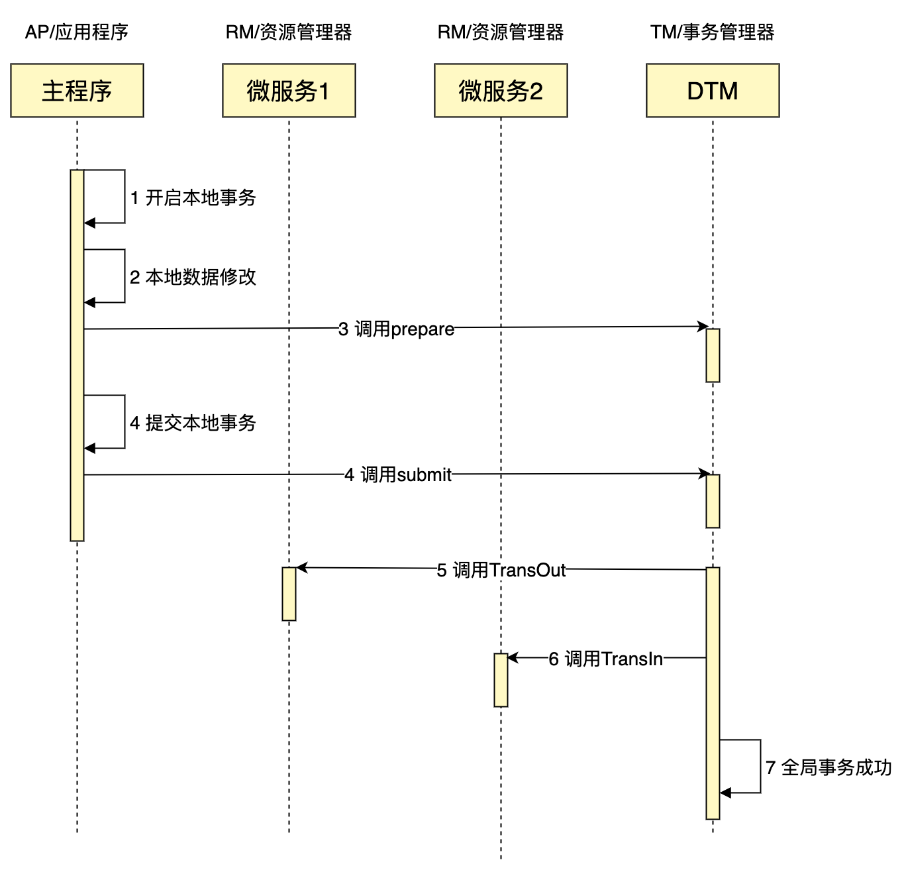
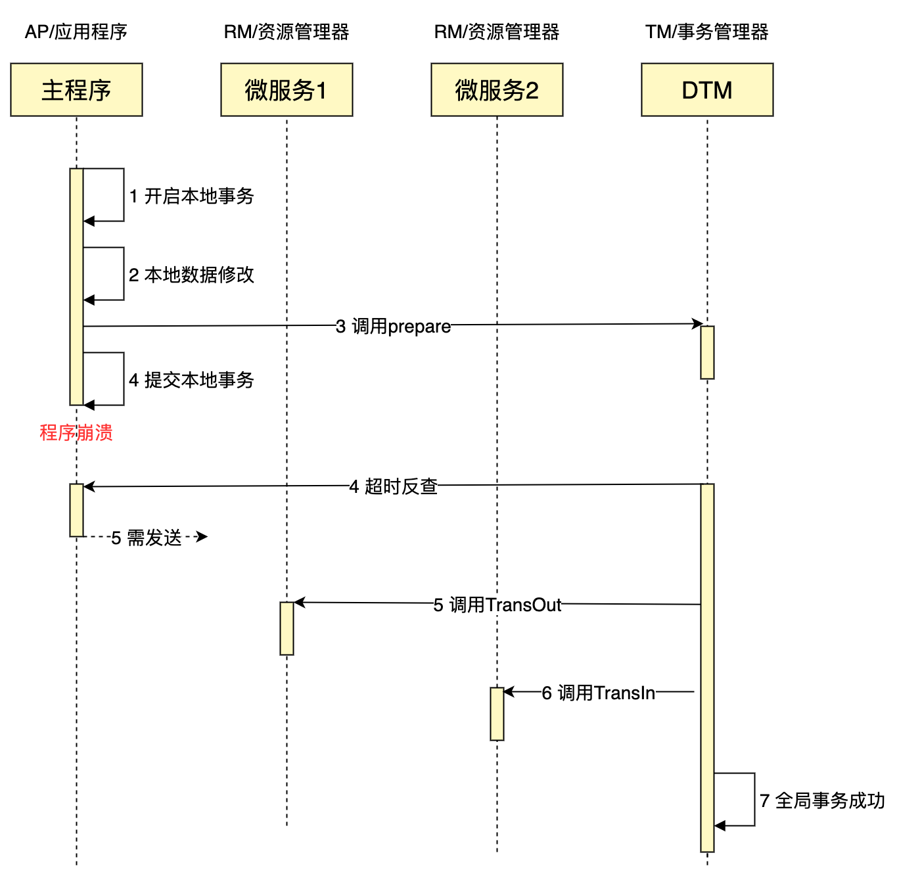
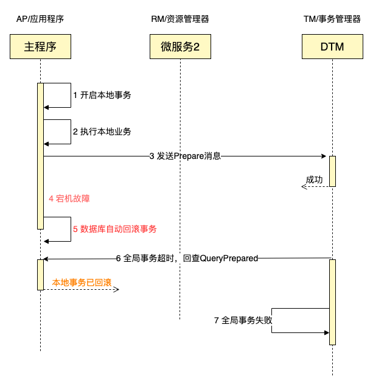

# 二阶消息

跨服务更新数据是应用开发常见的任务，如果一些关键数据对一致性的要求较高，不容许只更新一部分，而业务上也不需要支持回滚的话，那么通常就会采用本地消息表的方式来保证最终一致。

本文提出了一种新模式，新架构，优雅的解决了消息最终一致性的问题，带来更加简易快捷的开发新体验。

下面我们以跨行转账作为例子，给大家详解这种新架构。业务场景介绍如下：

我们需要跨行从A转给B 30元，我们先进行可能失败的转出操作TransOut，即进行A扣减30元。如果A因余额不足扣减失败，那么转账直接失败，返回错误；如果扣减成功，那么进行下一步转入操作，因为转入操作没有余额不足的问题，可以假定转入操作一定会成功。

## HTTP 接入
完成上述任务的核心代码如下所示：

``` Go
msg := dtmcli.NewMsg(DtmServer, gid).
	Add(busi.Busi+"/TransIn", &TransReq{Amount: 30})
err := msg.PrepareAndSubmit(busi.Busi+"/QueryPreparedB", db, func(tx *sql.Tx) error {
	return busi.SagaAdjustBalance(tx, busi.TransOutUID, -req.Amount, "SUCCESS")
})
```

这部分代码中
- 首先生成一个DTM的msg全局事务，传递dtm的服务器地址和全局事务id
- 给msg添加一个分支业务逻辑，这里的业务逻辑为余额转入操作TransIn，然后带上这个服务需要传递的数据，金额30元
- 然后调用msg的PrepareAndSubmit，这个函数保证业务成功执行和msg全局事务提交，要么同时成功，要么同时失败
	1. 第一个参数为回查URL，详细含义稍后说
	2. 第二个参数为sql.DB，是业务访问的数据库对象
	3. 第三个参数是业务函数，我们这个例子中的业务是给A扣减30元余额

PrepareAndSubmit是如何保证业务成功执行与msg提交的原子性的呢？请看如下的时序图：


一般情况下，时序图中的7个步骤会正常完成，整个业务按照预期进行，全局事务完成。这里面有个新的内容需要解释一下，就是msg的提交是按照两个阶段发起的，第一阶段调用Prepare，第二阶段调用Commit，DTM收到Prepare调用后，不会调用分支事务，而是等待后续的Submit。只有收到了Submit，开始分支调用，最终完成全局事务。

## 如何保证原子性
在分布式系统中，各类的宕机和网络异常都是需要考虑的，下面我们来看看可能发生的问题：

首先我们要达到的最重要目标是业务成功执行和msg事务是原子操作，因此首先看如果在业务完成提交后，发送Submit消息前出现了宕机故障会怎么样，新架构如何保证原子性？

我们来看看这种情况下的时序图：



如果在本地事务提交之后，在发送Submit前，出现了进程Crash或者机器宕机会怎么样？这个时候DTM会在一定超时时间之后，取出只Prepare但未Submit的msg事务，调用msg事务指定的回查服务。

您的回查服务逻辑，不需要手动编写，只需要按照如下代码进行调用即可：
``` Go
	app.GET(BusiAPI+"/QueryPreparedB", dtmutil.WrapHandler2(func(c *gin.Context) interface{} {
		return MustBarrierFromGin(c).QueryPrepared(dbGet())
	}))
```

这个回查函数，会到表里面查询，本地事务是否提交了：
- **已提交：** 返回成功，dtm进行下一步子事务调用
- **已回滚：** 返回失败，dtm终止全局事务，不再进行子事务调用
- **进行中：** 这个回查会等待最终结果，然后按照前面的已提交/已回滚的情况处理

我们来看看本地事务被回滚的时序图：


如果在dtm收到Prepare调用后，AP在事务提交前，遇见故障宕机，那么数据库会检测到AP的连接断开，自动回滚本地事务。

后续dtm轮询取出已经超时的，只Prepare但没有Submit的全局事务，进行回查。回查服务发现本地事务已回滚，返回结果给dtm。dtm收到已回滚的结果后，将全局事务标记为失败，并结束该全局事务。

## 易用性对比
采用新架构处理一致性问题，仅需要：
- 定义好本地业务逻辑，指定下一步处理的服务即可
- 定义QueryPrepared处理服务，复制粘贴例子代码即可。

然后我们看看其他方案情况
#### 二阶消息 vs 本地消息表

上述的问题也可以采用本地消息表方案（方案详情参考[分布式事务最经典的七种解决方案](https://segmentfault.com/a/1190000040321750)），来保证数据的最终一致性。如果采用本地消息表，需要的工作包括：
- 在本地事务中执行本地业务逻辑，将消息插入消息表并最后提交
- 编写轮询任务，将本地消息表的消息，发给消息队列
- 消费消息，并将消息发给相应的处理服务

两者对比，二阶消息有以下优点：
- 无需学习或维护任何消息队列
- 不需要处理轮询任务
- 不需要消费消息

#### 二阶消息 vs 事务消息(RocketMQ)

上述的问题也可以采用RocketMQ的事务消息方案（方案详情参考[分布式事务最经典的七种解决方案](https://segmentfault.com/a/1190000040321750)），来保证数据的最终一致性。如果采用本地消息表，需要的工作包括：

如果采用事务消息，需要的工作包括：
- 开启本地事务，发送半消息，提交事务，发送commit消息
- 消费超时的半消息，对于收到的超时半消息，查询本地数据库，然后进行Commit/Rollback
- 消费已提交的消息，并将消息发送给处理服务

两者对比，二阶消息有以下优点：
- 无需学习或维护任何消息队列
- 本地事务与发送消息之间的复杂操作需要手动处理，一不小心，可能出现bug。而二阶消息则是全自动处理
- 不需要消费消息

二阶消息在二阶段提交方面，与RocketMQ的事务消息非常相似，是受到RocketMQ的事务消息启发后提出的新架构。

#### 额外的优点
对比于前面讲述的队列方案，二阶消息还有很多额外的优点：
- 二阶消息整个暴露的接口，完全与队列无关，只跟实际的业务和服务调用相关，对开发人员更加友好
- 二阶消息不用考虑消息队列消息堆积及其他故障等问题，因为二阶消息只依赖dtm，开发人员可以认为dtm与系统中其他一个普通无状态服务一样，只依赖背后的存储 Mysql/Redis。
- 消息队列是异步的，而二阶消息同时支持异步和同步，默认异步，只需要打开msg.WaitResult=true，那么可以同步等待下游服务完成
- 二阶消息还支持同时指定多个下游服务

#### 二阶消息未来展望
二阶消息能够大幅降低消息最终一致性解决方案的难度，获得广泛的应用。未来dtm会考虑添加后台，允许动态指定下游服务，提供更高的灵活性。如果您原先采用消息队列来做服务解耦，那么这个dtm的后台，允许你直接指定某个消息的多个接收函数，无需编写消息消费者，带来更加简单、直观、易用的开发体验。

## 回查原理剖析
前面的时序图中，以及接口中都出现了回查服务，在二阶消息中，是复制粘贴代码自动处理的，而RocketMQ的事务消息，则是手动处理的。那么自动处理的原理是什么？

要进行回查，首先要在业务数据库实例中，建立一张独立的表，里面保存全局事务id。在处理业务事务时，会把gid写入到这张表。

当我们用gid回查时，如果能够在表中查到gid，那么说明本地事务已提交，这样就可以返回dtm，告知本地事务已提交。

当我们用gid回查时，没有在表中查到gid，那么说明本地事务未提交，此时可能的结果是两个，一是事务还在进行中，而是事务已回滚。我查了许多关于RocketMQ的资料，未找到有效的解决方案。搜到所有解决方案是，如果未查到结果，那么什么都不做，等待下一次回查，如果2分钟或者更久的回查，一直都是查不到的，那么认为本地事务已回滚。

上述这种方案有很大的问题：
- 两分钟还查不到gid，并不能认为本地事务已回滚，极端情况下，可能发生数据库故障（例如进程或磁盘卡住了），持续时间超过2分钟，最后数据又提交了，那么这个时候，数据就不是最终一致了，就需要人工介入处理了
- 如果一个本地事务，已经回滚了，但是回查操作，还会在两分钟之内，按照10s左右的时间间隔，不断的进行轮询，会给服务器造成不必要的压力

而dtm的二阶消息方案，则彻底解决了这部分的问题。dtm的二阶消息工作过程如下：

1. 在处理本地事务时，会将gid插入到dtm_barrier.barrier表中，同时带上插入原因为committed。该表有一个唯一索引，主要字段为gid。
2. 当进行回查时，二阶消息的操作不是直接查gid是否存在，而是再insert ignore一条带有相同gid的数据，同时带上插入原因为rollbacked。此时如果表中如果已有gid的记录，那么新的插入操作就会被ignore，否则数据会被插入。
3. 然后再用gid查询表中的记录，如果查到记录的reason为committed，那么说明本地事务已提交；如果查到记录的reason为rollbacked，那么说明本地事务已回滚。

那么对比RocketMQ回查时的常见方案，二阶消息是如何区分出进行中和已回滚呢？其中的技巧在于回查时插入的数据，如果回查时，数据库的事务还在进行中，那么插入操作就会被进行中的事务阻塞，因为插入操作会等待事务中持有的锁。如果插入操作正常返回，那么数据库中的本地事务，必定已结束，必然是已提交或已回滚。

