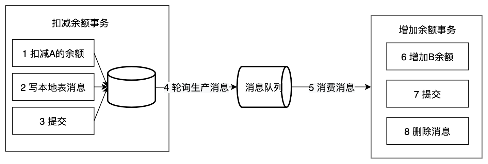

# 其他事务模式

dtm目前实现了常见的四种事务模式，TCC、SAGA、XA、事务消息，还有其他的事务模式，下面做一下简单介绍

## 本地消息表

本地消息表这个方案最初是 ebay 架构师 Dan Pritchett 在 2008 年发表给 ACM 的文章。设计核心是将需要分布式处理的任务通过消息的方式来异步确保执行。

大致流程如下：

写本地消息和业务操作放在一个事务里，保证了业务和发消息的原子性，要么他们全都成功，要么全都失败。

容错机制：

- 扣减余额事务 失败时，事务直接回滚，无后续步骤
- 轮序生产消息失败， 增加余额事务失败都会进行重试

本地消息表的特点：

- 长事务仅需要分拆成多个任务，使用简单
- 生产者需要额外的创建消息表
- 每个本地消息表都需要进行轮询
- 消费者的逻辑如果无法通过重试成功，那么还需要更多的机制，来回滚操作

在使用上面，事务消息接口的接入比本地消息表要方便很多，因此dtm实现了事务消息，未实现本地消息表

## 最大努力通知

发起通知方通过一定的机制最大努力将业务处理结果通知到接收方。具体包括：

有一定的消息重复通知机制。因为接收通知方可能没有接收到通知，此时要有一定的机制对消息重复通知。
消息校对机制。如果尽最大努力也没有通知到接收方，或者接收方消费消息后要再次消费，此时可由接收方主动向通知方查询消息信息来满足需求。
前面介绍的的本地消息表和事务消息都属于可靠消息，与这里介绍的最大努力通知有什么不同？

可靠消息一致性，发起通知方需要保证将消息发出去，并且将消息发到接收通知方，消息的可靠性关键由发起通知方来保证。

最大努力通知，发起通知方尽最大的努力将业务处理结果通知为接收通知方，但是可能消息接收不到，此时需要接收通知方主动调用发起通知方的接口查询业务处理结果，通知的可靠性关键在接收通知方。

解决方案上，最大努力通知需要：

- 提供接口，让被通知方能够通过接口查询业务处理结果
- 消息队列ACK机制，消息队列按照间隔1min、5min、10min、30min、1h、2h、5h、10h的方式，逐步拉大通知间隔 ，直到达到通知要求的时间窗口上限。之后不再通知

最大努力通知适用于业务通知类型，例如微信交易的结果，就是通过最大努力通知方式通知各个商户，既有回调通知，也有交易查询接口

最大努力通知更多是业务上的设计，在基础设施层，可以直接使用事务消息

## AT事务模式

这是阿里开源项目[seata](https://github.com/seata/seata)中的一种事务模式，在蚂蚁金服也被称为FMT。

- 优点是该事务模式使用方式，类似 XA 模式，业务无需编写各类补偿操作，回滚由框架自动完成
- 缺点也类似 XA ，存在较长时间的锁，不满足高并发的场景，但锁定时间比 XA 短，性能更高一些。另外 AT 模式使用的时候，可能出现脏回滚

有兴趣的同学可以参考[Seata-AT](http://seata.io/zh-cn/docs/dev/mode/xa-mode.html)

DTM未实现AT，考虑的因素有以下几点：

- 发生脏回滚需要手动处理
- 要避免脏回滚需要访问子事务表的所有业务人员都通过统一注解访问，使用门槛高
- 实现 AT 的客户端会很重，与dtm支持跨语言的初衷相悖

## 小结

主要的事务模式比较多，dtm的事务模式支持了绝大多数的应用场景
