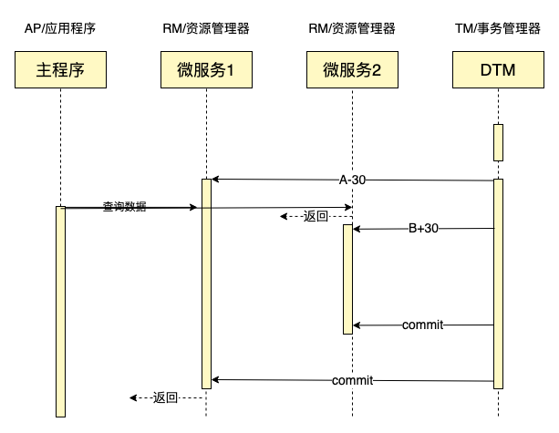
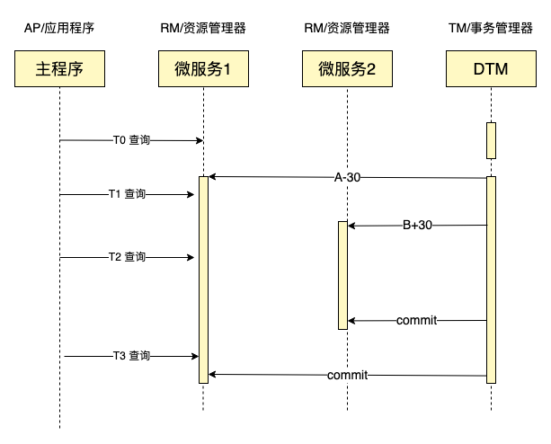
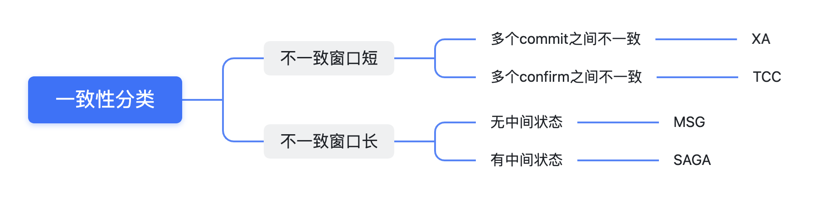

随着业务的快速发展、业务复杂度越来越高，几乎每个公司的系统都会从单体走向分布式，特别是转向微服务架构。随之而来就必然遇到分布式事务这个难题，DTM致力于提供一个简单易用、跨语言，同时具备高性能、高可用、可扩展的分布式事务解决方案。

## 基础理论

在讲解具体方案之前，我们先了解一下分布式事务所涉及到的基础理论知识。

我们拿转账作为例子，A需要转100元给B，那么需要给A的余额-100元，给B的余额+100元，整个转账要保证，A-100和B+100同时成功，或者同时失败。看看在各种场景下，是如何解决这个问题的。

## 事务

把多条语句作为一个整体进行操作的功能，被称为数据库事务。数据库事务可以确保该事务范围内的所有操作都可以全部成功或者全部失败。

事务具有 4 个属性：原子性、一致性、隔离性、持久性。这四个属性通常称为 ACID 特性。

- Atomicity（原子性）：一个事务中的所有操作，要么全部完成，要么全部不完成，不会结束在中间某个环节。事务在执行过程中发生错误，会被恢复到事务开始前的状态，就像这个事务从来没有执行过一样。
- Consistency（一致性）：在事务开始之前和事务结束以后，数据库的完整性没有被破坏。完整性包括外键约束、应用定义的等约束不会被破坏。
- Isolation（隔离性）：数据库允许多个并发事务同时对其数据进行读写和修改的能力，隔离性可以防止多个事务并发执行时由于交叉执行而导致数据的不一致。
- Durability（持久性）：事务处理结束后，对数据的修改就是永久的，即便系统故障也不会丢失。

主流的数据库例如Mysql、Postgres等，都支持ACID事务，其内部会采用MVCC（多版本并发控制）技术，实现高性能、高并发的本地事务。MVCC技术是数据库的技术基石，非常重要，但是内容很多，这里就不再展开细说，有兴趣的同学，可以自行查找相关资料学习。

## 分布式理论

分布式事务涉及多个节点，是一个典型的分布式系统，与单机系统有非常大的差别。一个分布式系统最多只能同时满足一致性（Consistency）、可用性（Availability）和分区容错性（Partition tolerance）这三项中的两项，这被称为CAP理论。

#### C 一致性

分布式系统中，数据一般会存在不同节点的副本中，如果对第一个节点的数据成功进行了更新操作，而第二个节点上的数据却没有得到相应更新，这时候读取第二个节点的数据依然是更新前的数据，即脏数据，这就是分布式系统数据不一致的情况。

在分布式系统中，如果能够做到针对一个数据项的更新操作执行成功后，所有的用户都能读取到最新的值，那么这样的系统就被认为具有强一致性（或严格的一致性）。

请注意CAP中的一致性和ACID中的一致性，虽然单词相同，但实际含义不同，请注意区分

#### A 可用性

在集群中一部分节点故障后，集群整体是否还能响应客户端的读写请求。

在现代的互联网应用中，如果因为服务器宕机等问题，导致服务长期不可用，是不可接受的

#### P 分区容错性

以实际效果而言，分区相当于对通信的时限要求。系统如果不能在时限内达成数据一致性，就意味着发生了分区的情况，必须就当前操作在 C 和 A 之间做出选择。

提高分区容忍性的办法就是一个数据项复制到多个节点上，那么出现分区之后，这一数据项仍然能在其他区中读取，容忍性就提高了。然而，把数据复制到多个节点，就会带来一致性的问题，就是多个节点上面的数据可能是不一致的。

#### 面临的问题

对于多数大型互联网应用的场景，主机众多、部署分散，而且现在的集群规模越来越大，所以节点故障、网络故障是常态，而且要保证服务可用性达到N个9，即保证P和A，舍弃C。

#### BASE理论

BASE是Basically Available（基本可用）、Soft state（软状态）和Eventually consistent（最终一致性）三个短语的简写，BASE是对CAP中一致性和可用性权衡的结果，其来源于对大规模互联网系统分布式实践的结论，是基于CAP定理逐步演化而来的，其核心思想是即使无法做到强一致性（Strong consistency），但每个应用都可以根据自身的业务特点，采用适当的方式来使系统达到最终一致性（Eventual consistency）。接下来我们着重对BASE中的三要素进行详细讲解。

- 基本可用是指分布式系统在出现不可预知故障的时候，允许损失部分可用性——但请注意，这绝不等价于系统不可用。
- 弱状态也称为软状态，和硬状态相对，是指允许系统中的数据存在中间状态，并认为该中间状态的存在不会影响系统的整体可用性，即允许系统在不同节点的数据副本之间进行数据同步的过程存在延时。
- 最终一致性强调的是系统中所有的数据副本，在经过一段时间的同步后，最终能够达到一个一致的状态。因此，最终一致性的本质是需要系统保证最终数据能够达到一致，而不需要实时保证系统数据的强一致性

总的来说，BASE理论面向的是大型高可用可扩展的分布式系统，提出通过牺牲强一致性来获得可用性，并允许数据在一段时间内是不一致的，但最终达到一致状态。

许多的NoSQL是按照BASE理论进行设计的，典型的例子包括：Dynamo、Cassandra、CouchDB。

##  分布式事务

银行跨行转账业务是一个典型分布式事务场景，假设A需要跨行转账给B，那么就涉及两个银行的数据，无法通过一个数据库的本地事务保证转账的ACID，只能够通过分布式事务来解决。

分布式事务就是指事务的发起者、资源及资源管理器和事务协调者分别位于分布式系统的不同节点之上。在上述转账的业务中，用户A-100操作和用户B+100操作不是位于同一个节点上。本质上来说，分布式事务就是为了保证在分布式场景下，数据操作的正确执行。

分布式事务可以分为两类：
- 第一类为：NewSQL的内部分布式事务，这类事务不是我们今天讨论的重点，仅做简单叙述
- 第二类为：跨数据库、跨服务的分布式事务，这类事务是dtm主要研究的对象，后面会详细讲解

## NewSQL的分布式事务

以Spanner、TiDB为代表的NewSQL，在内部集群多节点间，实现了ACID的事务，即提供给用户的事务接口与普通本地事务无差别，但是在内部，一个事务是支持多个节点多条数据的写入，此时无法采用本地ACID的MVCC技术，而是会采用一套复杂的分布式MVCC来做到ACID。大多数的NewSQL分布式事务技术都采用这篇论文[Percolator](http://research.google.com/pubs/pub36726.html)介绍的核心技术。

那么从CAP的角度看，三者不能同时兼备，那么NewSQL选择了什么，牺牲了什么呢？

首先我们看C（一致性），这是数据库类的应用必须具备的。只要数据写入了，后续的读，一定能获取到最新写入的结果。你可以想象如果不是这样，那么你的应用处理关键事务如订单时，如果读到的结果不是最新的，那么你就无法确定订单的当前准确状态，就无法进行正确处理，更无从谈起ACID特性。

然后我们看P（分区），只要是分布式系统，那么P就是必然有概率发生的，因此P是分布式系统必须处理，必须具备的特性。

那么我们再看A（可用性），由于架构的发展，系统出现网络分区的频率可以大幅降低。另外分布式共识算法的发展，可以在较短的时间，正确的达成共识，从而从分区故障中恢复。谷歌分布式锁Chubby的公开数据显示，集群能提供99.99958％的平均可用性，一年也就130s的运行中断。这样的可用性相当高，对实际应用的影响微乎其微。

也就是说随着现代工程和共识算法的发展，可以构造出满足CP的系统，同时接近于满足A，可以称之为CP+HA，这里HA代表的是非100%的A，而是很高的可用性。

公开的数据显示，谷歌的Spanner支持ACID的事务特性，同时提供了高达的5个9的可用性，因此这是一个CP+HA。

既然NewSQL已经达到了CP+HA，那么从CAP的角度看，前面介绍BASE中的典型Dynamo系统等，只达到了AP，他们是否就可以退出历史舞台了呢？不会！NewSQL和BASE的系统之间，性能上差异可能是巨大的，因此在实际高性能高并发应用上，BASE也是有不少的应用场景的。

## 跨服务跨库的分布式事务

::: tip 分布式事务
虽然分布式事务分为两类，一类是前面介绍的NewSQL的分布式事务，不是DTM研究的重点，另一类是DTM重点研究的跨服务跨库分布式事务，为了简化描述，本教程如果无特殊说明，关键词：**分布式事务**指的是**跨库跨服务更新数据的分布式事务**
:::

dtm主要研究跨服务，跨数据库的分布式事务，这类分布式事务只是部分遵循 ACID 规范的：

- 原子性：严格遵循
- 一致性：事务完成后的一致性严格遵循；事务中的一致性可适当放宽
- 隔离性：并行事务间不可影响；事务中间结果可见性允许安全放宽
- 持久性：严格遵循

这里面一致性和隔离性都没有严格遵守，但是ACID这四个特性中，AID这三个特性其实是数据库实现的人非常关心，而对于使用数据库的人，最终的用户，最关心的则是C，即用户视角看，分布式事务的一致性是什么样的？

对于这里面的C（一致性），我们以一个非常具体的业务例子，来进行解释。假如我们正在处理一个转账业务，假设是A转给B 30元，在本地事务的支持下，我们的用户看到A+B的总金额，在整个转账前后，以及转账过程中，都是保持不变的。那么这个时候用户认为他看到的数据是一致的，符合业务约束的。

当我们业务变复杂，引入多个数据库和大量微服务时，上述本地事务的一致性，依旧是业务非常关心。假如一个业务更新操作，跨库或者跨服务时，那么此时业务关心的一致性问题，就变成了 分布式事务中的一致性问题。

在单机本地事务中，A+B的总金额在任何时刻去查（以常见的ReadCommitted或ReadRepeatable隔离级别），都是不变的，也就是业务约束一直都保持的这种一致性，我们称之为强一致性。

## 无法强一致
目前在跨库、跨服务的分布式实际应用中，尚未看到有强一致性的方案。

我们来看看一致性级别最高的XA事务（读者如果还不了解，可以参考[XA事务](./xa)），是否是强一致的，我们以跨行转账（在这里，我们以跨库更新AB来模拟）作为例子来说明，下面是一个XA事务的时序图：

在这个时序图中，我们在如图所示的时间点发起查询，就是在两个commit中间进行的查询，那么我们查到的结果数据，将是A+B+30，不等于A+B，不符合强一致的要求。

> 从微服务1查到的结果为A，因为A-30这个事务未提交；从微服务2查到的结果为B+30；总和为A+B+30

从理论上分析，由于是分布式系统，那么一定是无法保证两个commit同时结束，只要两个commit中间有时间差，那么无论如何我们都无法保证强一致性。

## 理论上的强一致性
我们接下来思考，普通XA事务不是强一致的，但假如完全不考虑性能因素，有没有可能在理论上做到强一致：

我们先看看如果我们把XA事务涉及的数据库，隔离级别设定到Serializable，是否能到到强一致的效果呢？我们来看看前面的时序场景：

这种情况下，查到结果等于A+B。

> 此时从微服务1查到的结果为A-30，因为在串行化之下，查询会等到A-30这个事务提交才返回；从微服务2查到的结果为B+30；总和为A+B。

但是又有另一些场景出现了问题，如下图所示：

按照图中时序查询的结果是：A+B-30，依旧是不一致。

> 此时从微服务1查到的结果为A-30，因为在串行化之下，查询会等到A-30这个事务提交才返回；从微服务2查到的结果为B，因为B+30这个事务还没有开始；总和为A+B-30.

深入思考这个强一致的问题之后，有一种做法可以做到强一致，做法如下：

- 对于查询，也采用XA事务，并且查询数据时，采用select for update的方式，所有数据查完之后，再xa commit
- 为了避免死锁，需要将涉及到的数据库排序，访问数据都必须要按照相同的数据库顺序来写入和查询

在上述策略下，我们可以看到，在时序图任何一个时间点进行查询，获得的结果都是A+B

- 在T0时间查询，那么修改一定发生在查询全部完成之后，所以查询得到结果A+B
- 在T1，T2，T3查询，那么查询结果返回一定全部发生在修改完成之后，所以查询得到结果也是A+B

很明显这种理论上的强一致，效率极低，所有有数据交集的数据库事务都是串行执行，而且还需要按照特定的顺序查询/修改数据，因此成本极高，几乎无法应用在生产中。

未来有没有可能借鉴NewSQL的这种方式，来实现跨库、跨微服务这类分布式事务的强一致性？理论上是可以的。

- 实现跨服务但不跨库的分布式事务一致性，会相对简单一些，其中一种方式就是实现XA事务中的TMRESUME选项。我们从前面的分析中看到，XA事务的不一致，来源于分布式系统上的两个commit无法同时完成，现在已经在一个数据库，只是跨服务，那么TMRESUME可以允许我们将某个服务的xa事务继续往前操作，最终提交时，只有一个xa commit，因此避免了两个xa commit中间的不一致时间窗口，那么就是强一致的。
- 实现跨数据库的分布式事务一致性，会困难很多，因为各个数据库的内部版本机制都不一样，想要协同非常困难。困难来自于两点：一是不同厂商之间的MVCC机制不一样，例如Spanner是TrueTime，TiDB是单点授时，还有一些是逻辑时钟，想要兼容多种MVCC非常困难。二是不同厂商难以有足够的商业利益驱动去做这样的协同。

## 最终一致性
从前面的分析中可以看到，在分布式事务进行的过程中，一致性是无法得到保证的，但是分布式事务完成之后，一致性是没问题的，严格遵守的。因此我们将分布式事务方案称为最终一致性方案，这个最终一致性，与CAP中的最终一致性用了同样的词语，但他们的具体含义是不一样的，在CAP中是指读取操作最终能够读取到最后一次写入的结果，在分布式事务中是指最终事务完成后，数据严格满足业务约束。

既然现有的各种分布式事务方案都无法做到强一致，那么最终一致性之间是否有差别呢？我们进行了以下关于一致性强弱的分类：

一致性由强到弱分别是：

[XA事务](./xa)>[TCC](./tcc)>[二阶段消息](./msg)>[SAGA](./saga)

他们的分类为：

- **不一致窗口短**：XA和TCC在理想的情况下，可以做到不一致的窗口时间很短
- **不一致窗口长**：SAGA和MSG则缺少控制不一致窗口时间的方法，相对来说会更长
- **XA**：XA虽然不是强一致，但是XA的一致性是多种分布式事务中，一致性最好的，因为他处于不一致的状态时间很短，只有一部分分支开始commit，但还没有全部commit的这个时间窗口，数据是不一致的。因为数据库的commit操作耗时，通常是10ms内，因此不一致的窗口期很短。
- **TCC**：理论上，TCC可以用XA来实现，例如Try-Prepare，Confirm-Commit，Cancel-Rollback。但绝大多数时候，TCC会在业务层自己实现Try|Confirm|Cancel，因此Confirm操作耗时，通常高于XA中的Commit，不一致的窗口时间比XA长
- **MSG**：二阶消息型事务在第一个操作完成后，在所有操作完成之前，这个时间窗口是不一致的，持续时长一般比前两者更久。
- **SAGA**：SAGA的不一致窗口时长与消息接近，但是如果发生回滚，而子事务中正向操作修改的数据又会被用户看到，这部分数据就是错误数据，容易给用户带来较差的体验，因此一致性是最差的。

我们这里的分类仅仅从我们关心的几个维度进行了归纳，适用于多数场景，但并不一定适用所有情况。

## 小结

在这里，我们介绍了分布式事务相关的理论，分析了分布式事务的最终一致性，接下来，我们将介绍DTM的架构与实践
