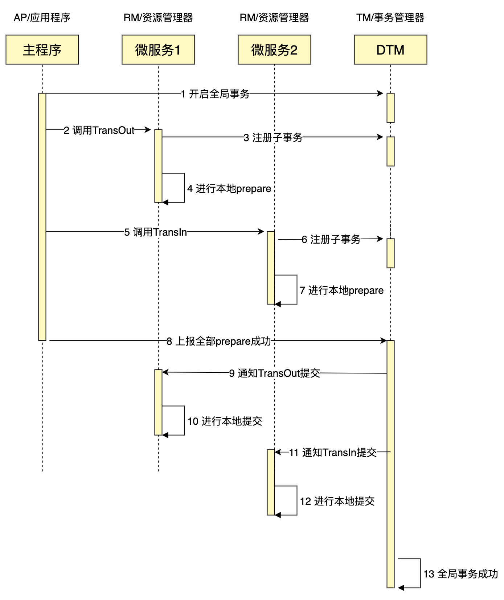
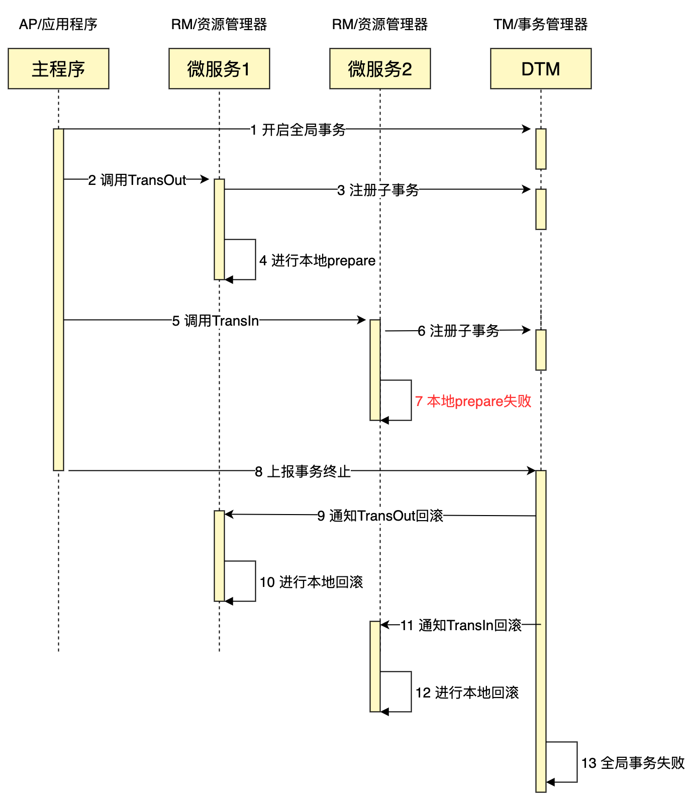

# XA事务模式

## XA是什么

XA是由X/Open组织提出的分布式事务的规范，XA规范主要定义了(全局)事务管理器(TM)和(局部)资源管理器(RM)之间的接口。本地的数据库如mysql在XA中扮演的是RM角色

XA一共分为两阶段：

第一阶段（prepare）：即所有的参与者RM准备执行事务并锁住需要的资源。参与者ready时，向TM报告已准备就绪。
第二阶段 (commit/rollback)：当事务管理者(TM)确认所有参与者(RM)都ready后，向所有参与者发送commit命令。

目前主流的数据库基本都支持XA事务，包括mysql、oracle、sqlserver、postgre

我们看看本地数据库是如何支持XA的：

第一阶段 准备

``` sql
XA start '4fPqCNTYeSG'
UPDATE `user_account` SET `balance`=balance + 30,`update_time`='2021-06-09 11:50:42.438' WHERE user_id = '1'
XA end '4fPqCNTYeSG'
XA prepare '4fPqCNTYeSG'
-- 当所有的参与者完成了prepare，就进入第二阶段 提交
xa commit '4fPqCNTYeSG'
```

## XA实战

我们来完成一个完整的XA，我们先看一个成功的XA时序图：



由于XA模式，需要用到本地数据库的功能，不能复用之前的通用处理函数，因此整个代码量会比其他几种模式的最简单示例要复杂一些：

``` go
// XaSetup 挂载http的api，创建XaClient
func XaSetup(app *gin.Engine) {
	app.POST(BusiAPI+"/TransInXa", common.WrapHandler(xaTransIn))
	app.POST(BusiAPI+"/TransOutXa", common.WrapHandler(xaTransOut))
	var err error
	XaClient, err = dtmcli.NewXaClient(DtmServer, config.DB, Busi+"/xa", func(path string, xa *dtmcli.XaClient) {
		app.POST(path, common.WrapHandler(func(c *gin.Context) (interface{}, error) {
			return xa.HandleCallback(c.Query("gid"), c.Query("branch_id"), c.Query("action"))
		}))
	})
	e2p(err)
}

// XaFireRequest 注册全局XA事务，调用XA的分支
func XaFireRequest() string {
	gid := dtmcli.MustGenGid(DtmServer)
	res, err := XaClient.XaGlobalTransaction(gid, func(xa *dtmcli.Xa) (interface{}, error) {
		resp, err := xa.CallBranch(&TransReq{Amount: 30}, Busi+"/TransOutXa")
		if dtmcli.IsFailure(resp, err) {
			return resp, err
		}
		return xa.CallBranch(&TransReq{Amount: 30}, Busi+"/TransInXa")
	})
	dtmcli.PanicIfFailure(res, err)
	return gid
}

func xaTransIn(c *gin.Context) (interface{}, error) {
	return XaClient.XaLocalTransaction(c, func(db *sql.DB, xa *dtmcli.Xa) (interface{}, error) {
		if reqFrom(c).TransInResult == "FAILURE" {
			return M{"dtm_result": "FAILURE"}, nil
		}
		_, err := common.SdbExec(db, "update dtm_busi.user_account set balance=balance+? where user_id=?", reqFrom(c).Amount, 2)
		return M{"dtm_result": "SUCCESS"}, err
	})
}

func xaTransOut(c *gin.Context) (interface{}, error) {
	return XaClient.XaLocalTransaction(c, func(db *sql.DB, xa *dtmcli.Xa) (interface{}, error) {
		if reqFrom(c).TransOutResult == "FAILURE" {
			return M{"dtm_result": "FAILURE"}, nil
		}
		_, err := common.SdbExec(db, "update dtm_busi.user_account set balance=balance-? where user_id=?", reqFrom(c).Amount, 1)
		return M{"dtm_result": "SUCCESS"}, err
	})
}
```

上面的代码首先注册了一个全局XA事务，然后添加了两个子事务TransOut、TransIn。子事务全部执行成功之后，提交给dtm。dtm收到提交的xa全局事务后，会调用所有子事务的xa commit，完成整个xa事务。

### 失败回滚

如果有一阶段prepare操作失败，那么dtm会调用各子事务的xa rollback，进行回滚，最后事务成功回滚。

我们在上述XaFireRequest的请求负荷中，传递TransInResult=FAILURE，让他失败

``` go
req := &examples.TransReq{Amount: 30, TransInResult: "FAILURE"}
```

失败的时序图如下：



