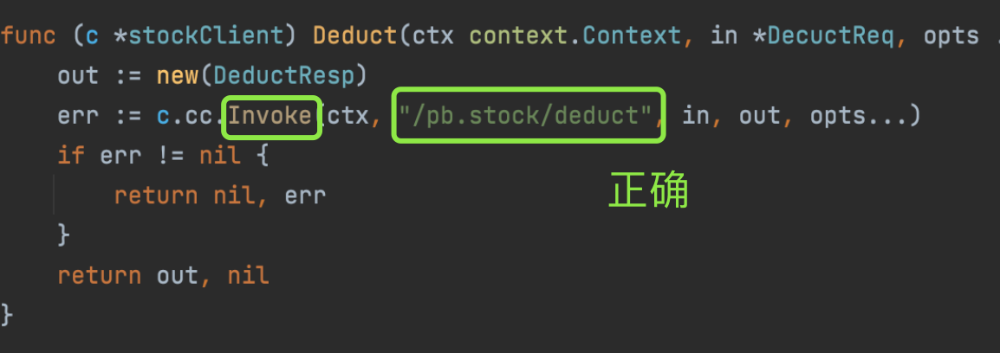
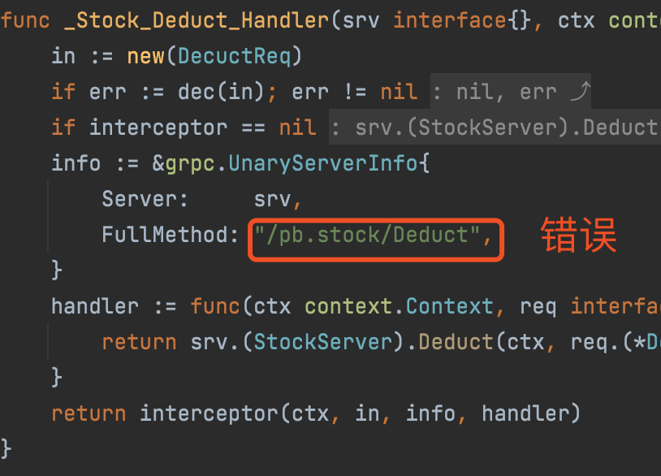

# go-zero支持
dtm与go-zero进行了深度合作，打造了go-zero原生支持分布式事务的解决方案，提供了极简的用户体验。感谢go-zero作者[kevwan](https://github.com/kevwan)的大力支持

dtm从v1.6.0开始原生支持go-zero微服务框架，go-zero的版本需要v1.2.4以上

## 运行一个已有的示例
我们以etcd作为注册服务中心为例，按照如下步骤运行一个go-zero的示例：

- 启动etcd
```
# 前提：已安装etcd
etcd
```
- 配置dtm
```
MicroService:
  Driver: 'dtm-driver-gozero' # 配置dtm使用go-zero的微服务协议
  Target: 'etcd://localhost:2379/dtmservice' # 把dtm注册到etcd的这个地址
  EndPoint: 'localhost:36790' # dtm的本地地址
```
- 启动dtm
```
# 前提：配置好dtm的数据库
go run app/main.go dev
```
- 运行一个go-zero的服务
```
git clone github.com/dtm-labs/dtmdriver-clients && cd dtmdriver-clients
cd gozero/trans && go run trans.go
```
- 发起一个go-zero使用dtm的事务
```
# 在dtmdriver-clients的目录下
cd gozero/app && go run main.go
```

当您在trans的日志中看到
```
2021/12/03 15:44:05 transfer out 30 cents from 1
2021/12/03 15:44:05 transfer in 30 cents to 2
2021/12/03 15:44:05 transfer out 30 cents from 1
2021/12/03 15:44:05 transfer out 30 cents from 1
```
那就是事务正常完成了

## 开发接入
参考[dtm-labs/dtmdriver-clients](https://github.com/dtm-labs/dtmdriver-clients/blob/main/gozero/app/main.go)的代码

``` go
// 下面这行导入gozero的dtm驱动
import _ "github.com/dtm-labs/driver-gozero"

// dtm已经通过前面的配置，注册到下面这个地址，因此在dtmgrpc中使用该地址
var dtmServer = "etcd://localhost:2379/dtmservice"

// 下面从配置文件中Load配置，然后通过BuildTarget获得业务服务的地址
var c zrpc.RpcClientConf
conf.MustLoad(*configFile, &c)
busiServer, err := c.BuildTarget()

  // 使用dtmgrpc生成一个消息型分布式事务并提交
	gid := dtmgrpc.MustGenGid(dtmServer)
	msg := dtmgrpc.NewMsgGrpc(dtmServer, gid).
    // 事务的第一步为调用trans.TransSvcClient.TransOut
    // 可以从trans.pb.go中找到上述方法对应的Method名称为"/trans.TransSvc/TransOut"
    // dtm需要从dtm服务器调用该方法，所以不走强类型
    // 而是走动态的url: busiServer+"/trans.TransSvc/TransOut"
		Add(busiServer+"/trans.TransSvc/TransOut", &busi.BusiReq{Amount: 30, UserId: 1}).
		Add(busiServer+"/trans.TransSvc/TransIn", &busi.BusiReq{Amount: 30, UserId: 2})
	err := msg.Submit()

```

整个开发接入的过程很少，前面的注释已经很清晰，就不再赘述了


### 注意事项
在去找*.pb.go的文件中的grpc访问的方法路径时候，一定要找invoke的路径





## 深入理解动态调用
在go-zero使用dtm的分布式事务时，许多的调用是从dtm服务器发起的，例如TCC的Confirm/Cancel，SAGA/MSG的所有调用。

dtm无需知道组成分布式事务的相关业务api的强类型，它是动态的调用这些api。

grpc的调用，可以类比于HTTP的POST，其中：

- c.BuildTarget() 产生的target类似于URL中的Host
- "/trans.TransSvc/TransOut" 相当于URL中的Path
- &busi.BusiReq{Amount: 30, UserId: 1} 相当于Post中Body
- pb.Response 相当于HTTP请求的响应

通过下面这部分代码，dtm就拿到了完整信息，就能够发起完整的调用了

`Add(busiServer+"/trans.TransSvc/TransOut", &busi.BusiReq{Amount: 30, UserId: 1})`

## 更加完整的例子
热心的社区同学Mikael帮忙写了一个内容更加丰富的例子，结合实际应用和子事务屏障，完整的演示了一个线上实际运行的分布式事务，有兴趣的同学可以参考：

[https://github.com/Mikaelemmmm/gozerodtm](https://github.com/Mikaelemmmm/gozerodtm)

## 其他方式接入
go-zero的微服务还有非etcd的其他方式，我们依次说明他们的接入方式

### 直连
对于直连这种方式，您只需要在上面dtm的etcd配置基础上，将Target设置为空字符串即可。

直连的情况，不需要将dtm注册到注册中心

### K8S
对于K8S这种方式，您只需要在上面dtm的etcd配置基础上，将Target设置为空字符串即可。

在K8S中，将服务注册到K8S中，是有deployment.yaml完成的，应用内部，不需要进行注册

## 小结

欢迎使用[dtm](https://github.com/dtm-labs/dtm)，并star支持我们，一起共建golang的微服务生态
