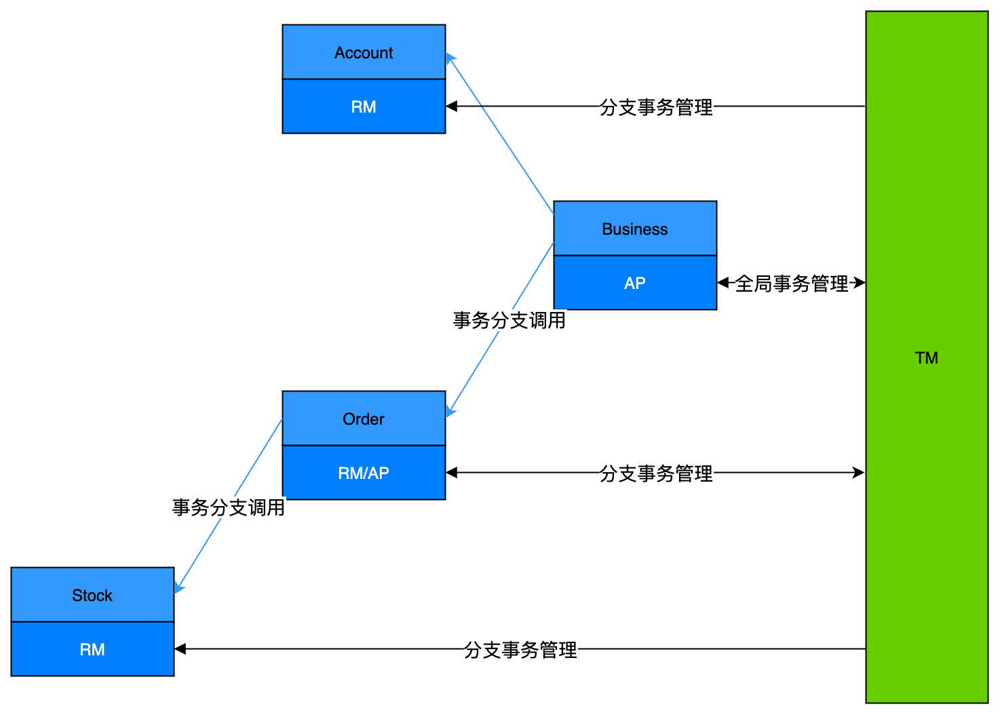

# 架构

## 架构与角色

dtm包括服务端和客户端，整体架构图如下：

整个分布式事务的运行过程中，一共有三个角色参与，和OPEN/X XA事务标准类似，但也会有一些区别

- RM-资源管理器：RM管理分布式事务中的本地事务，负责相关数据的修改、提交、回滚、补偿等操作。通常对应一个微服务。
- AP-应用程序：AP会注册全局事务，按照业务规则，注册子事务，调用RM接口。通常对应一个微服务。
- TM-事务管理器：每个全局事务在TM注册，每个子事务也注册到TM。TM会协调所有的RM，将同一个全局事务的不同子事务，全部提交或全部回滚。对应dtm服务实例。

## 高可用

在DTM架构下，TM由dtm服务构成，每个dtm实例都是无状态的应用程序，他们将全局事务数据存储在dtm的数据库。实际业务只要给dtm配置了高可用的数据库，那么整个dtm服务就是天然高可用的。

在简单部署模式下，一方面每个dtm都提供rest服务，接受AP的事务请求。另一方面dtm还会启动一个协程，定时查询超时需要处理的全局事务，重试之前状态不确定的事务分支。

## 嵌套子事务

dtm的Tcc事务模式，支持子事务嵌套，流程图如下：

在这个流程图中，Order这个微服务，管理了订单相关的数据修改，同时还管理了一个嵌套的子事务，因此他即扮演了RM的角色，也扮演了AP的角色。

## 角色间通信协议

目前dtm只支持了http和grpc协议。由于分布式事务涉及多个角色协作，某些参与者可能出现暂时不可用，需要重试；某些参与者明确告知失败，需要进行回滚。

### HTTP

下面对各种情况进行分类说明，定义各类情况的返回值。接口类似微信/支付宝订单成功回调的接口，如果接口返回的结果中，包含SUCCESS，则表示成功；其他则表示出错，需要进行重试。

上面的架构图中，主要有以下几类接口：

AP调用TM的接口，主要为全局事务注册、提交，子事务注册等：
  - 成功: { dtm_result: "SUCCESS" }
  - 失败: { dtm_result: "FAILURE" }，表示这个请求状态不对，例如已经走fail的全局事务不允许再注册分支
  - 其他表示状态不确定，可重试

TM调用RM的接口，主要为二阶段的提交、回滚，以及saga的各分支
  - 成功: { dtm_result: "SUCCESS" }，表示这个接口调用成功，正常进行下一步操作
  - 失败: { dtm_result: "FAILURE" }，表示这个接口调用失败，全局事务需要进行回滚。例如saga中的正向操作如果返回FAILURE，则整个saga事务失败回滚
  - 其他结果则重试，一直重试，直到返回上述的两个结果之一

AP调用RM的接口，跟业务相关，主要是被TCC、XA两种模式调用。考虑到许多微服务的治理，都有失败重试的机制，因此建议接口设计如下
  - 成功: { dtm_result: "SUCCESS" }，表示这个接口调用成功，正常进行下一步操作。返回的结果可以额外包含其他业务数据。
  - 失败: { dtm_result: "FAILURE" }，表示这个接口调用失败，全局事务需要进行回滚。例如tcc中的Try动作如果返回FAILURE，则整个tcc全局事务回滚
  - 其他返回值，应当允许重试，重试如果还是失败，需要允许全局事务回滚。主要是因为TCC、XA事务的下一步操作不保存在数据库，而是在AP里，它需要及时响应用户，无法长时间等待故障恢复。

::: tip 接口数据注意点
dtm框架通过resp.String()是否包含SUCCESS/FAILURE来判断成功和失败，因此请避免在子事务接口返回的业务数据里包含这两个词。
:::

### GRPC

由于GRPC为强类型协议，并且定义好了各个错误状态码，并且能够定义不同的错误码，采用不同的重试策略，因此GRPC的协议如下：
- Aborted: 表示失败需要回滚，对应上述http协议中的{ dtm_result: "FAILURE" }，
- OK: 表示调用成功，对应上述http协议中的{ dtm_result: "SUCCESS" },可以进行下一步
- 其他错误吗：状态未知，可重试

## 重试策略

失败重试是微服务治理中，很重要的一个环节，上述http和grpc协议，能够很好的与主流的失败重试策略兼容

当全局事务由于某些组件导致临时故障，那么全局事务会暂时中断，后续dtm会定时轮询一小时内超时未完成的全局事务，进行重试。多次重试则间隔每次加倍，避免雪崩。

如果应用程序由于各类bug或故障导致全局事务在一小时内的都未进行重试，待开发人员修复bug或故障之后，可以通过手动修改dtm.trans_global中next_cron_time来触发重试。
